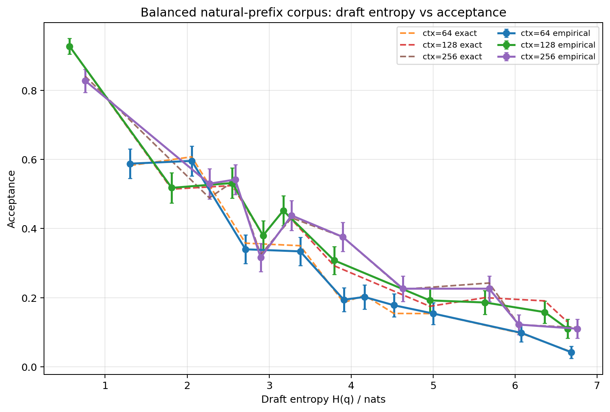
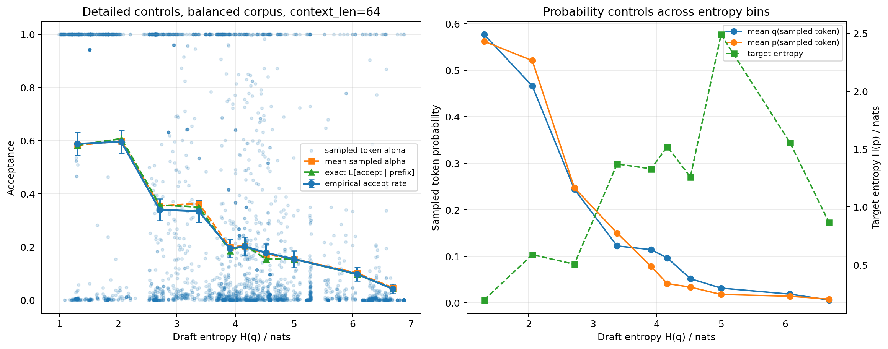
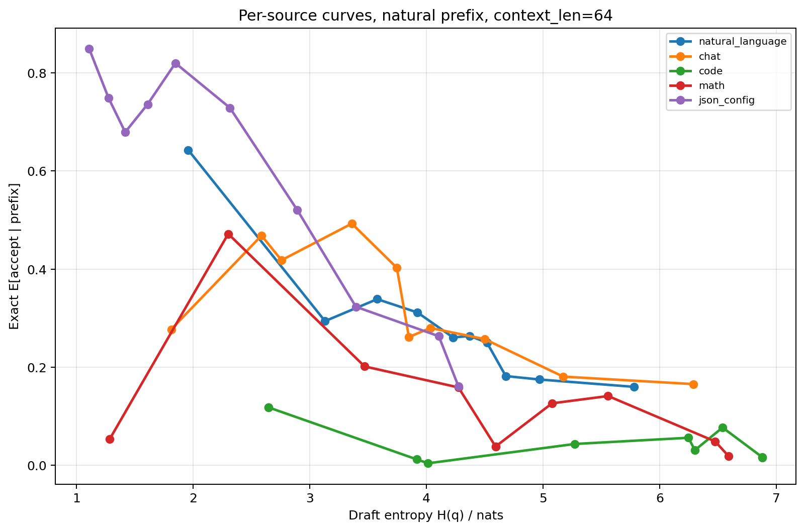
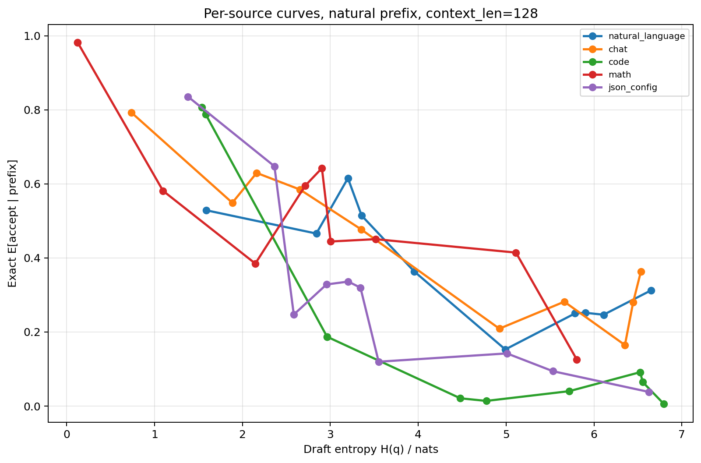
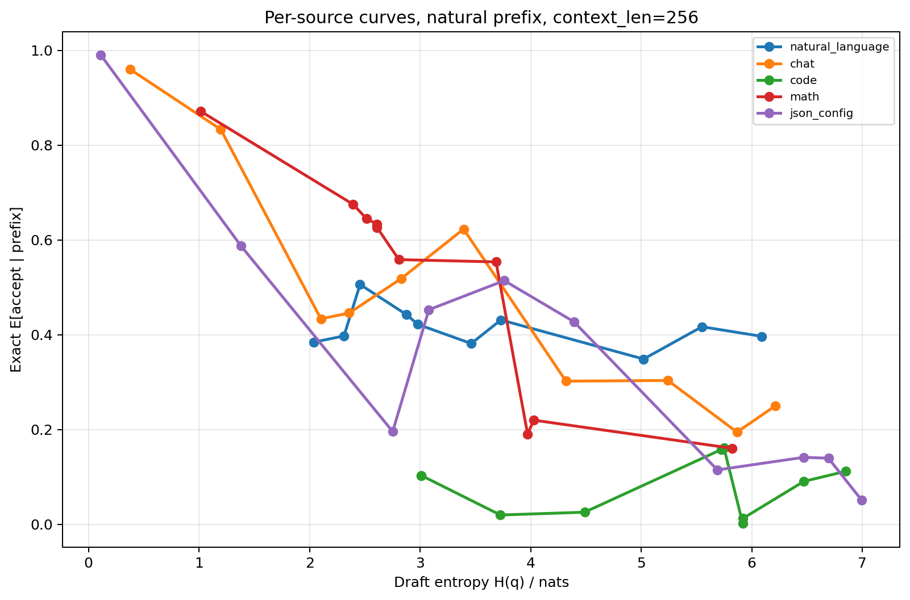
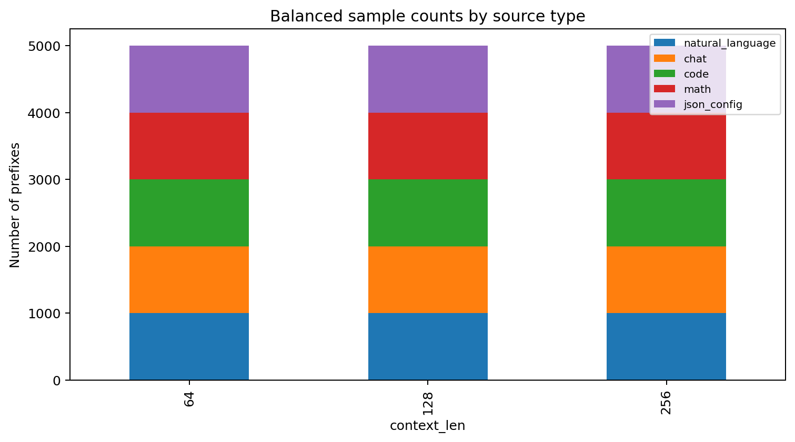

# Balanced natural-prefix draft entropy experiment

## Design

- Target: `Model/Llama-7B-Chat-Target`
- Draft: `Model/Llama-68M-Draft`
- Context lengths: 64, 128, 256
- Samples per context length: 5000
- Balanced source types: 1000 each for `natural_language`, `chat`, `code`, `math`, `json_config`
- Context construction: every prefix starts from the beginning of a prompt/document/function/problem/config; no random middle-window truncation.
- Acceptance rule: classic one-step speculative acceptance, `alpha = min(1, p(x)/q(x))`, with `x ~ q`.

## Logic checks

- Total token-level records: 15000
- Source balance: exactly 1000 samples per source type per context length
- `natural_prefix_start`: true for all rows
- Target and draft tokenizer model MD5: identical (`eeec4125e9c7560836b4873b6f8e3025`)
- Probability range checks: passed
- Empirical acceptance and mean sampled alpha are close:
  - ctx64: 0.2726 vs 0.2777
  - ctx128: 0.3764 vs 0.3775
  - ctx256: 0.3714 vs 0.3719

## Main figures

## Key output files

- `balanced_entropy_acceptance_experiment.py`
- `token_level_records.csv`
- `entropy_bin_summary_by_context.csv`
- `entropy_bin_summary_by_context_source.csv`
- `source_type_summary.csv`
- `correlations.csv`
- `audit_checks.json`
- `context_previews.json`
