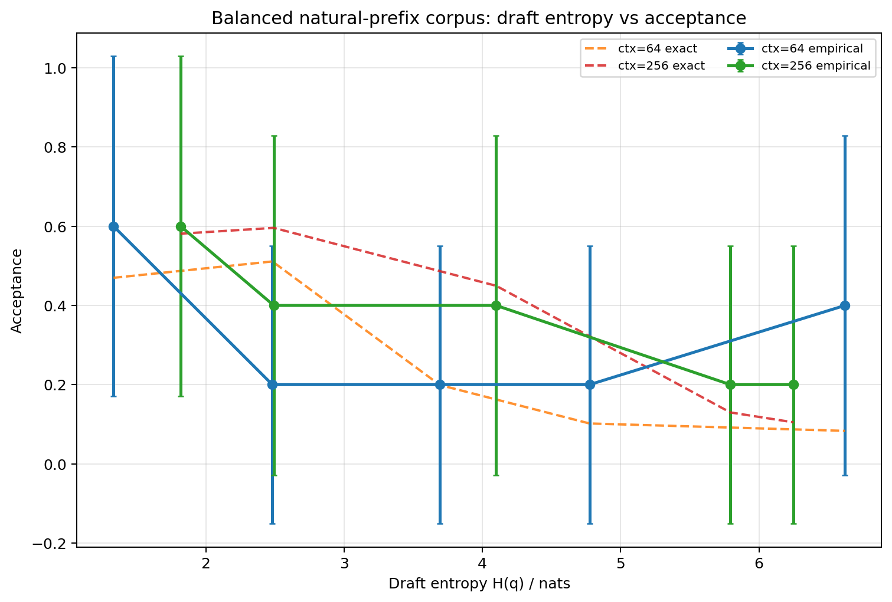
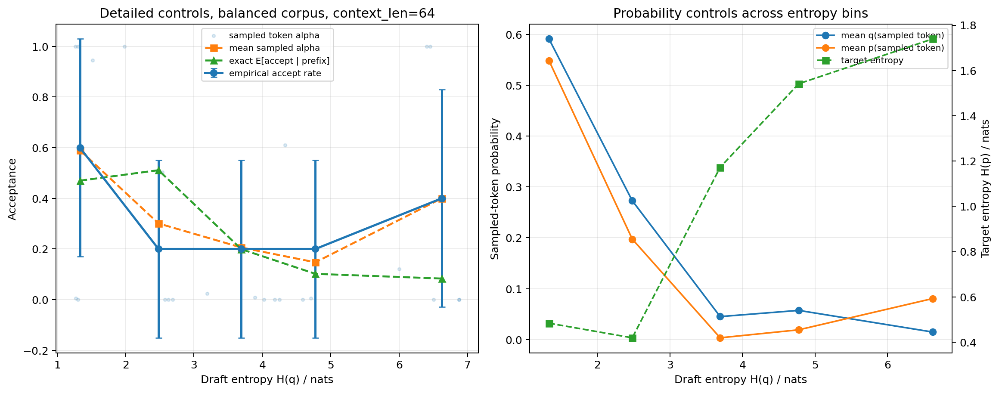
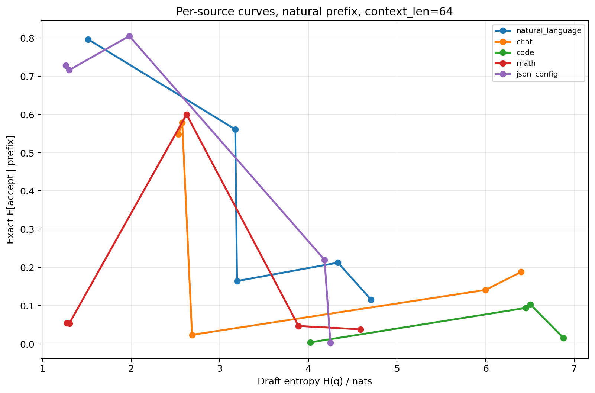
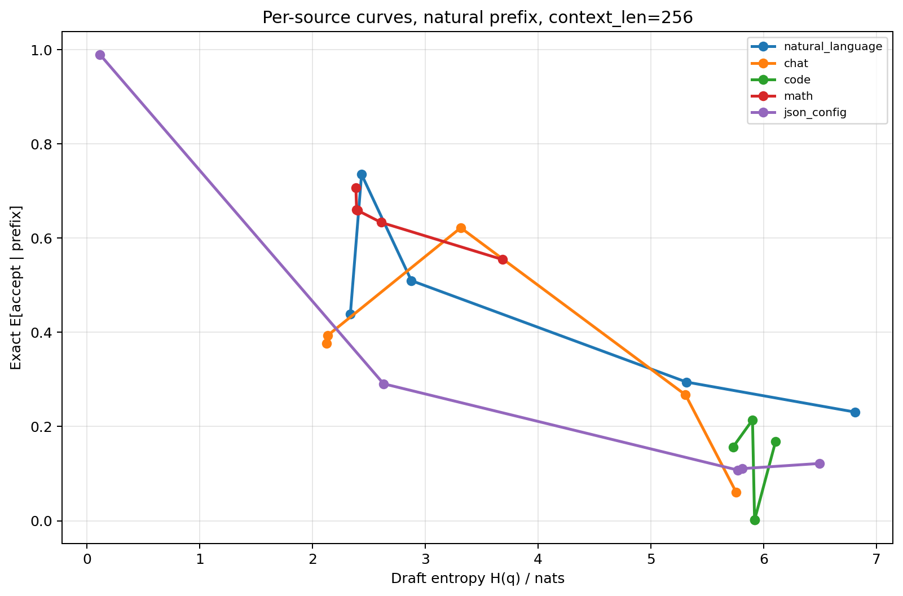

# Balanced natural-prefix draft entropy experiment

- Design: balanced natural-prefix; no random middle-window truncation
- Context lengths: [64, 256]
- Samples per type: 5
- Source types: natural_language, chat, code, math, json_config

## Main figures

