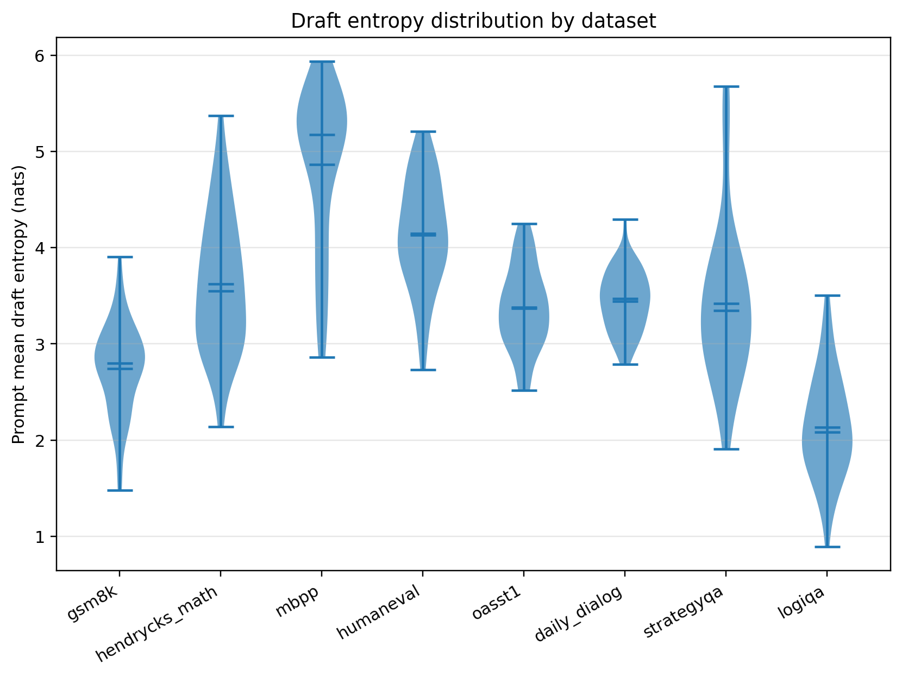
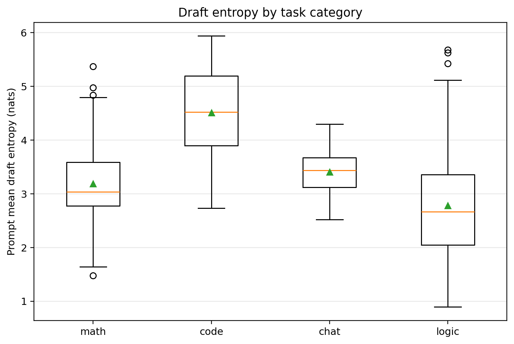
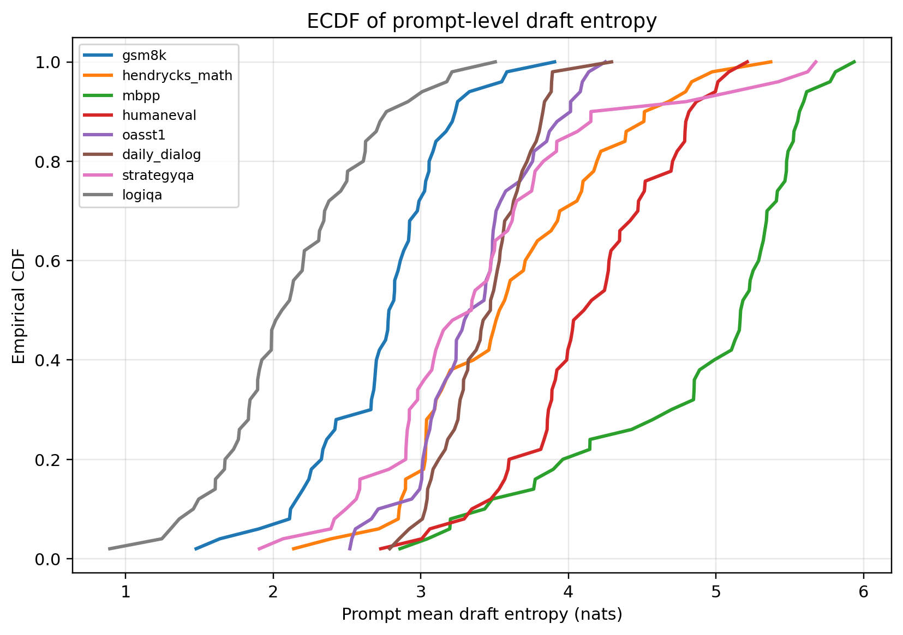
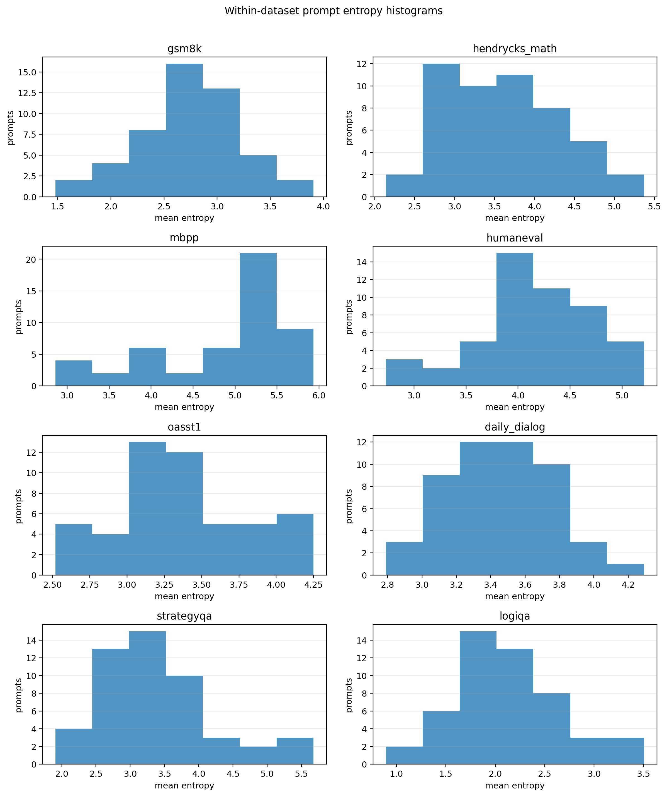
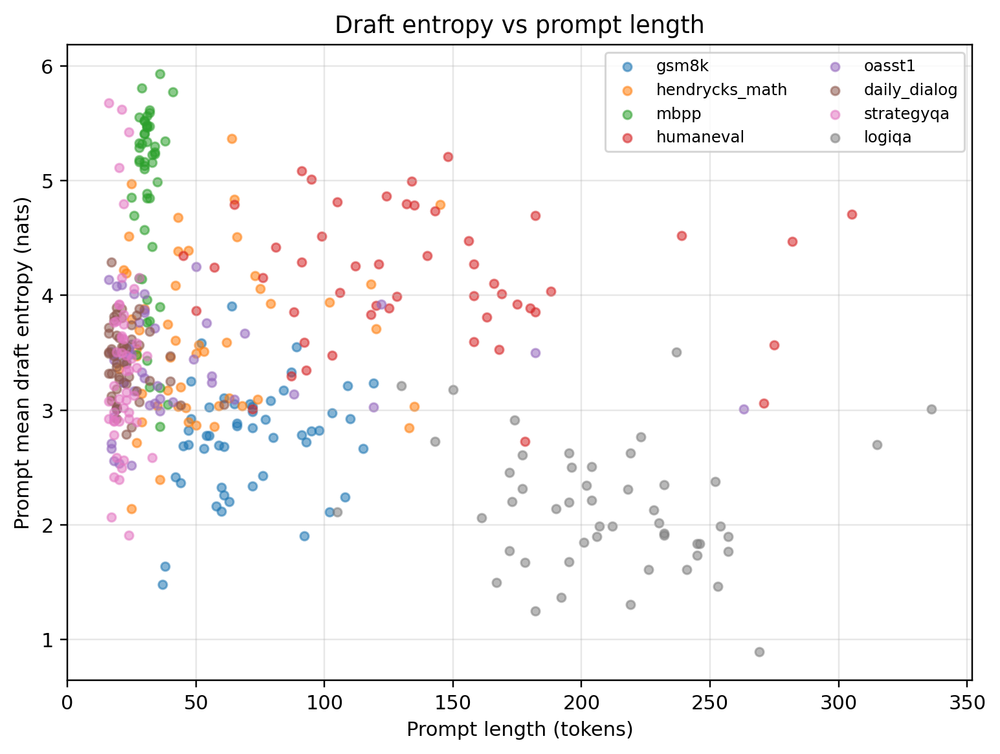
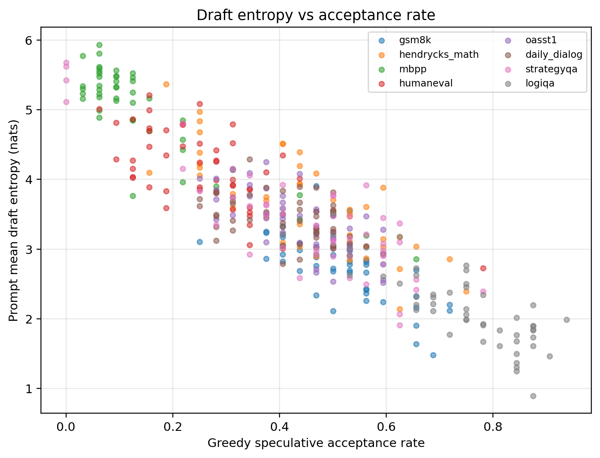

# Dataset draft entropy comparison experiment

## Goal

Compare the draft model's prompt-level mean next-token entropy across common math, code, chat, and logic datasets under greedy speculative decoding.

## Setup

- Draft model: `Model/Llama-68M-Draft`
- Target model: `Model/Llama-7B-Chat-Target`
- Requested datasets: `gsm8k, hendrycks_math, mbpp, humaneval, oasst1, daily_dialog, strategyqa, logiqa`
- Loaded datasets: `daily_dialog, gsm8k, hendrycks_math, humaneval, logiqa, mbpp, oasst1, strategyqa`
- Samples per dataset requested: 50
- Max new tokens per prompt: 32
- Draft proposal length gamma: 4
- Prompt length filter: [16, 512] tokens
- Dtype: fp16; attention implementation: eager
- Permutations for significance tests: 5000

## Audit checks

- Selected prompts: 400
- Token-level rows: 12800
- Entropy range OK: True
- Acceptance-rate range OK: True
- Generated tokens min/max: 32 / 32
- Tokenizer MD5: `{'Model/Llama-7B-Chat-Target/tokenizer.model': 'eeec4125e9c7560836b4873b6f8e3025', 'Model/Llama-68M-Draft/tokenizer.model': 'eeec4125e9c7560836b4873b6f8e3025'}`

## Dataset summary

category,dataset_id,n,mean_entropy,std_entropy,median_entropy,min_entropy,max_entropy,p10_entropy,p25_entropy,p75_entropy,p90_entropy,mean_acceptance_rate,mean_prompt_tokens,mean_proposed_tokens,iqr_entropy,cv_entropy
chat,daily_dialog,50,3.442044691665651,0.31713862911038276,3.472147433552891,2.789453871548176,4.292493114247918,3.041933045393671,3.233672005822882,3.66445795702748,3.8284238295513204,0.411875,23.12,32.0,0.43078595120459795,0.09213669708539292
chat,oasst1,50,3.3694698091702593,0.43323804105511415,3.378403912152862,2.519441073905909,4.250296052545309,2.915829999134439,3.06281182312523,3.647408892211388,4.014458253234625,0.439375,42.38,32.0,0.5845970690861577,0.12857751088198655
code,humaneval,50,4.145775801904383,0.5678657471778024,4.130432840669528,2.72888370975852,5.21156207472086,3.4617357294628164,3.856311986688524,4.519136348739266,4.821942782402038,0.260625,138.58,32.0,0.6628243620507424,0.1369745433211681
code,mbpp,50,4.864007835761295,0.8130623123198265,5.174494261853397,2.8591469498351216,5.935036554932594,3.4794091899384516,4.4633499681949615,5.453880445216782,5.568083040416241,0.168125,31.46,32.0,0.9905304770218208,0.16715892321184334
logic,logiqa,50,2.1354581694213812,0.5404594338867214,2.0850098145929223,0.8938272492960095,3.5047683524899185,1.4921657684695675,1.7865013472619466,2.4886651598862954,2.7822723047749607,0.74625,210.52,32.0,0.7021638126243488,0.25308827942678125
logic,strategyqa,50,3.4175330502795624,0.8283353272916226,3.3446935487154406,1.907148307063835,5.675716012716293,2.5562585977640992,2.9122207362088375,3.7601363073918037,4.2172398447990425,0.4425,21.76,32.0,0.8479155711829662,0.24237814678159814
math,gsm8k,50,2.7454514754374033,0.4733426915287379,2.8007860811048886,1.4784187639070296,3.906502257916145,2.1562003107741474,2.4200604660445606,3.0316462063783547,3.2353544518264243,0.51375,71.5,32.0,0.6115857403337941,0.17240978242142316
math,hendrycks_math,50,3.6216009313531687,0.7041554718559236,3.549939844524488,2.1391301036346704,5.370611988008022,2.8660775272292085,3.037518724333495,4.097067527036415,4.5315235743299125,0.4475,54.18,32.0,1.0595488027029205,0.19443209928511482

## Category summary

category,n,mean_entropy,std_entropy,median_entropy,p25_entropy,p75_entropy,mean_acceptance_rate
chat,100,3.405757250417955,0.37948677787354257,3.432699283672264,3.116874929721235,3.6692179398669396,0.425625
code,100,4.504891818832839,0.7855383604464486,4.51763760112226,3.8957104090368375,5.189607797190547,0.214375
logic,100,2.7764956098504716,0.9482916851636194,2.6622189370100386,2.0485299327574467,3.352309313748265,0.594375
math,100,3.183526203395286,0.741725194175437,3.03590658120811,2.772394765212084,3.584573011175962,0.480625

## Between-dataset test

scope,metric,num_groups,n,kruskal_h,permutation_p,permutations
dataset,prompt_mean_draft_entropy,8,400,239.18919501246864,0.0001999600079984003,5000

## Large pairwise differences

dataset_a,dataset_b,n_a,n_b,mean_a,mean_b,mean_diff_a_minus_b,cliffs_delta,cohens_d,permutation_p_raw,permutation_p_holm,large_difference_flag
daily_dialog,gsm8k,50,50,3.442044691665651,2.7454514754374033,0.6965932162282478,0.804,1.7290190161701293,0.0001999600079984003,0.005598880223955209,True
daily_dialog,humaneval,50,50,3.442044691665651,4.145775801904383,-0.7037311102387322,-0.7304,-1.5301242965608535,0.0001999600079984003,0.005598880223955209,True
daily_dialog,logiqa,50,50,3.442044691665651,2.1354581694213812,1.3065865222442699,0.956,2.9487467847763544,0.0001999600079984003,0.005598880223955209,True
daily_dialog,mbpp,50,50,3.442044691665651,4.864007835761295,-1.4219631440956437,-0.808,-2.3042330597053917,0.0001999600079984003,0.005598880223955209,True
gsm8k,hendrycks_math,50,50,2.7454514754374033,3.6216009313531687,-0.8761494559157654,-0.7152,-1.4603624458866222,0.0001999600079984003,0.005598880223955209,True
gsm8k,humaneval,50,50,2.7454514754374033,4.145775801904383,-1.40032432646698,-0.9384,-2.6787901301955657,0.0001999600079984003,0.005598880223955209,True
gsm8k,logiqa,50,50,2.7454514754374033,2.1354581694213812,0.6099933060160221,0.6192,1.2007489788213466,0.0001999600079984003,0.005598880223955209,True
gsm8k,mbpp,50,50,2.7454514754374033,4.864007835761295,-2.1185563603238915,-0.9552,-3.184586523958782,0.0001999600079984003,0.005598880223955209,True
gsm8k,oasst1,50,50,2.7454514754374033,3.3694698091702593,-0.624018333732856,-0.6808,-1.375296483189408,0.0001999600079984003,0.005598880223955209,True
gsm8k,strategyqa,50,50,2.7454514754374033,3.4175330502795624,-0.6720815748421591,-0.5392,-0.9962545293279061,0.0001999600079984003,0.005598880223955209,True
hendrycks_math,humaneval,50,50,3.6216009313531687,4.145775801904383,-0.5241748705512146,-0.444,-0.8194702869081413,0.0003999200159968006,0.005598880223955209,True
hendrycks_math,logiqa,50,50,3.6216009313531687,2.1354581694213812,1.4861427619317875,0.9168,2.3677254608790164,0.0001999600079984003,0.005598880223955209,True
hendrycks_math,mbpp,50,50,3.6216009313531687,4.864007835761295,-1.242406904408126,-0.7312,-1.6335406932467422,0.0001999600079984003,0.005598880223955209,True
humaneval,logiqa,50,50,4.145775801904383,2.1354581694213812,2.010317632483002,0.9872,3.626558948302811,0.0001999600079984003,0.005598880223955209,True
humaneval,mbpp,50,50,4.145775801904383,4.864007835761295,-0.7182320338569115,-0.5664,-1.0241966507639375,0.0001999600079984003,0.005598880223955209,True
humaneval,oasst1,50,50,4.145775801904383,3.3694698091702593,0.776305992734124,0.7192,1.537063748093862,0.0001999600079984003,0.005598880223955209,True
humaneval,strategyqa,50,50,4.145775801904383,3.4175330502795624,0.7282427516248209,0.5984,1.025485054520822,0.0001999600079984003,0.005598880223955209,True
logiqa,mbpp,50,50,2.1354581694213812,4.864007835761295,-2.7285496663399136,-0.9888,-3.9524139662688023,0.0001999600079984003,0.005598880223955209,True
logiqa,oasst1,50,50,2.1354581694213812,3.3694698091702593,-1.234011639748878,-0.9144,-2.519462704717165,0.0001999600079984003,0.005598880223955209,True
logiqa,strategyqa,50,50,2.1354581694213812,3.4175330502795624,-1.2820748808581812,-0.8416,-1.8331863289019332,0.0001999600079984003,0.005598880223955209,True
mbpp,oasst1,50,50,4.864007835761295,3.3694698091702593,1.4945380265910355,0.82,2.294183236696157,0.0001999600079984003,0.005598880223955209,True
mbpp,strategyqa,50,50,4.864007835761295,3.4175330502795624,1.4464747854817324,0.7344,1.7624153174331008,0.0001999600079984003,0.005598880223955209,True

## Highest within-dataset variability

category,dataset_id,n,mean_entropy,std_entropy,median_entropy,min_entropy,max_entropy,p10_entropy,p25_entropy,p75_entropy,p90_entropy,mean_acceptance_rate,mean_prompt_tokens,mean_proposed_tokens,iqr_entropy,cv_entropy
logic,logiqa,50,2.1354581694213812,0.5404594338867214,2.0850098145929223,0.8938272492960095,3.5047683524899185,1.4921657684695675,1.7865013472619466,2.4886651598862954,2.7822723047749607,0.74625,210.52,32.0,0.7021638126243488,0.25308827942678125
logic,strategyqa,50,3.4175330502795624,0.8283353272916226,3.3446935487154406,1.907148307063835,5.675716012716293,2.5562585977640992,2.9122207362088375,3.7601363073918037,4.2172398447990425,0.4425,21.76,32.0,0.8479155711829662,0.24237814678159814
math,hendrycks_math,50,3.6216009313531687,0.7041554718559236,3.549939844524488,2.1391301036346704,5.370611988008022,2.8660775272292085,3.037518724333495,4.097067527036415,4.5315235743299125,0.4475,54.18,32.0,1.0595488027029205,0.19443209928511482
math,gsm8k,50,2.7454514754374033,0.4733426915287379,2.8007860811048886,1.4784187639070296,3.906502257916145,2.1562003107741474,2.4200604660445606,3.0316462063783547,3.2353544518264243,0.51375,71.5,32.0,0.6115857403337941,0.17240978242142316
code,mbpp,50,4.864007835761295,0.8130623123198265,5.174494261853397,2.8591469498351216,5.935036554932594,3.4794091899384516,4.4633499681949615,5.453880445216782,5.568083040416241,0.168125,31.46,32.0,0.9905304770218208,0.16715892321184334

## Figures

## Key files

- `selected_prompts.jsonl`
- `token_entropy_records.csv`
- `prompt_entropy_summary.csv`
- `dataset_entropy_summary.csv`
- `category_entropy_summary.csv`
- `between_dataset_tests.csv`
- `pairwise_dataset_tests.csv`
- `within_dataset_variability.csv`
- `audit_checks.json`
- `metadata.json`