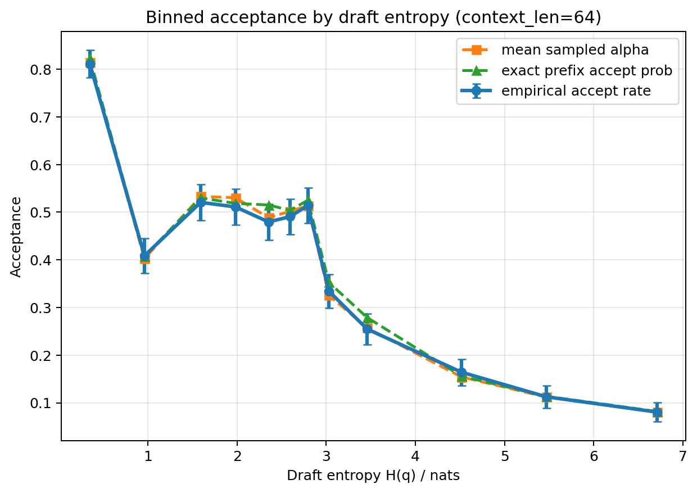
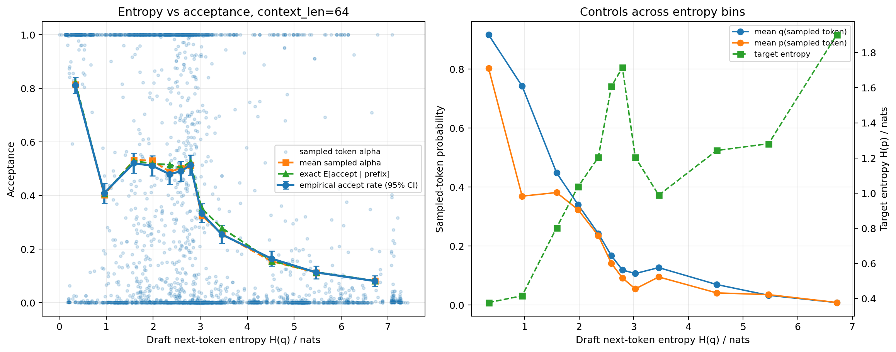

# Draft entropy vs speculative acceptance, context_len=64

- Target model: `Model/Llama-7B-Chat-Target`
- Draft model: `Model/Llama-68M-Draft`
- Samples: 8192 independent prefixes, each exactly 64 tokens
- Acceptance rule: classic speculative sampling, `alpha=min(1, p(x)/q(x))`, with `x~q`
- Main outputs:
  - `entropy_acceptance_ctx64.png/svg/pdf`
  - `binned_entropy_acceptance_ctx64.png/svg/pdf`
  - `token_level_records.csv`
  - `entropy_bin_summary.csv`
  - `metadata.json`

Main finding: acceptance is strongly lower in high-draft-entropy regions. The first entropy bin has empirical accept rate 0.811; the last bin has 0.081. Spearman correlation between draft entropy and exact prefix acceptance probability is -0.548.

