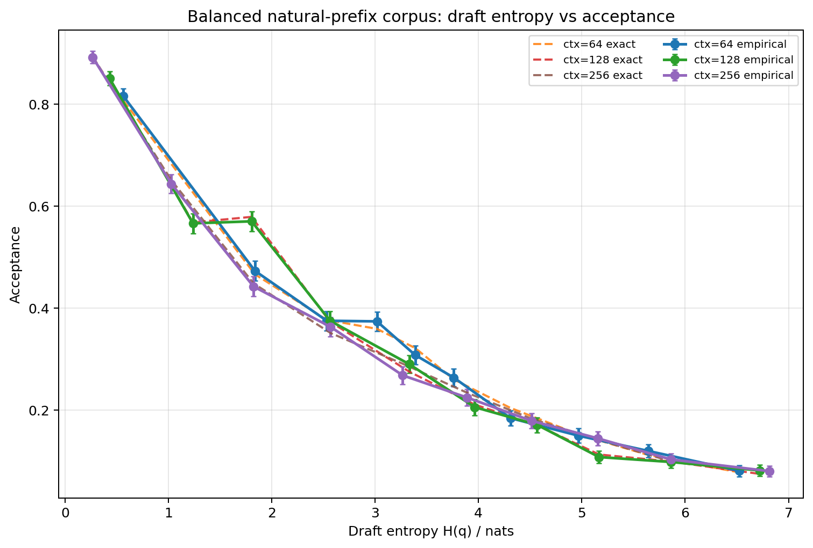
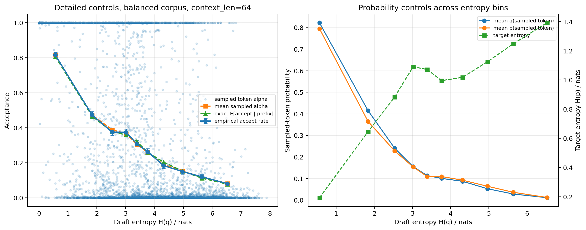
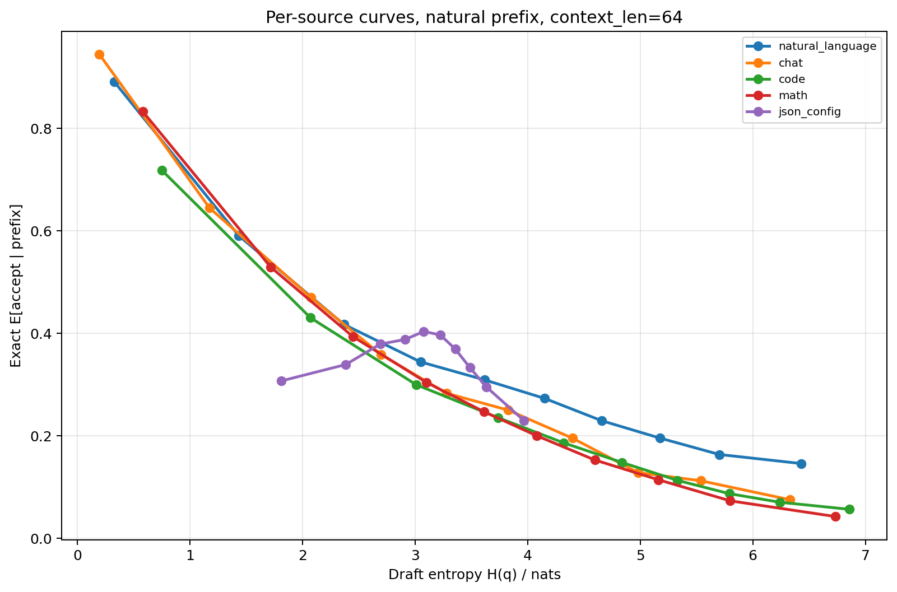
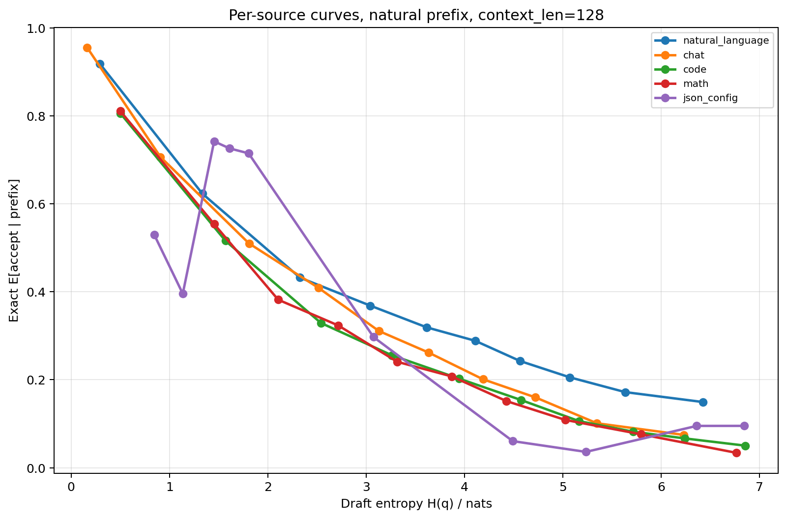
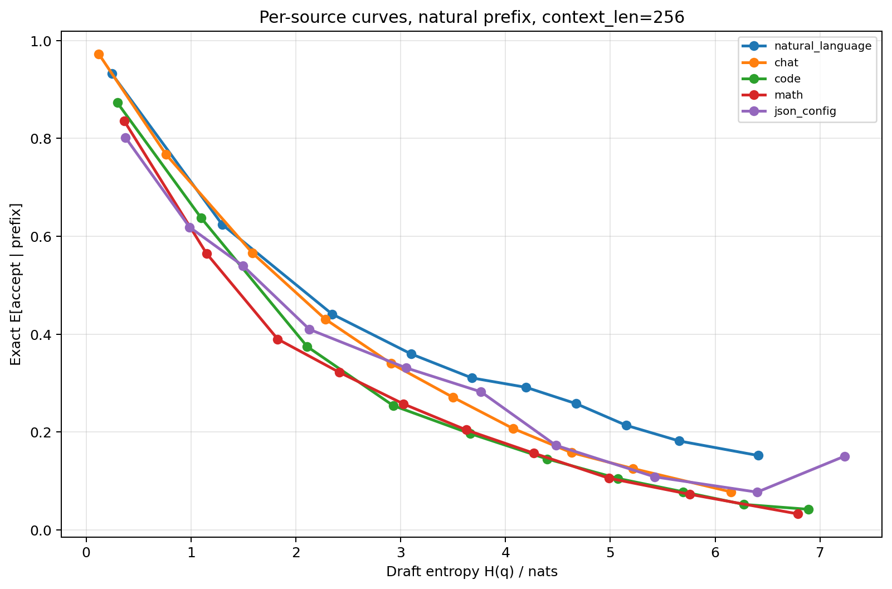
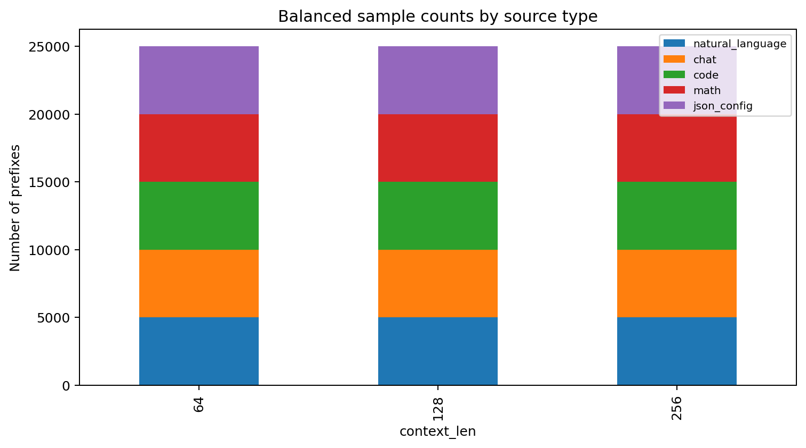
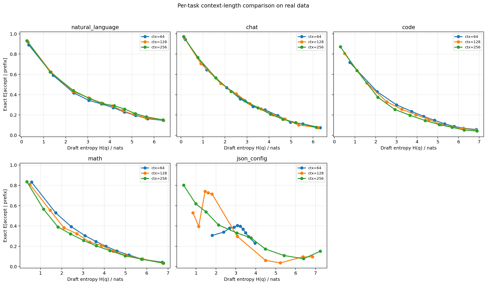
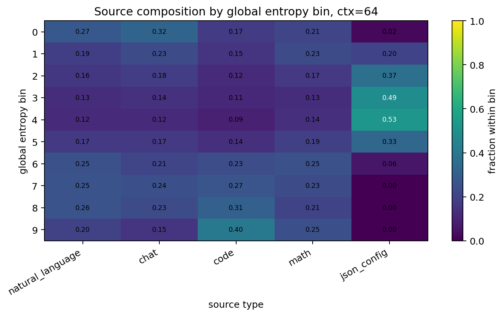
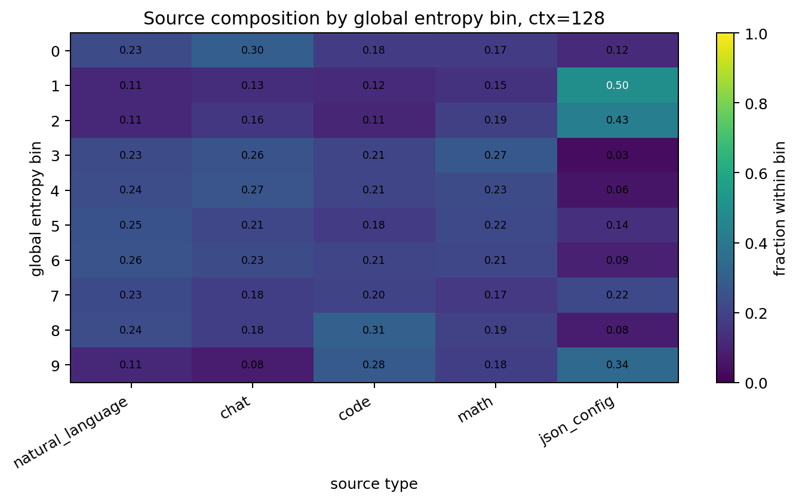
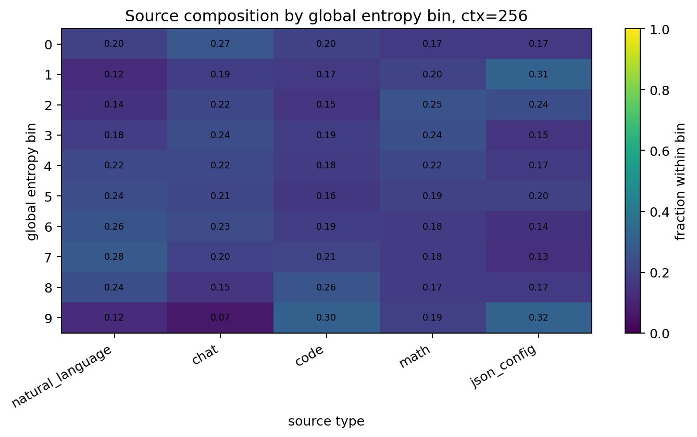

# Real-data natural-prefix draft entropy experiment

## Design

- Data are real public datasets, not template-generated prompts.
- Natural language: `wikitext/wikitext-103-raw-v1` article/document starts.
- Chat: `OpenAssistant/oasst1` conversation paths from root messages.
- Code: `code_search_net/python` function starts.
- Math: `EleutherAI/hendrycks_math` + `gsm8k` problem starts.
- Structured JSON: real `OpenAssistant/oasst1` rows serialized as JSON.
- Context lengths: [64, 128, 256]
- Samples per type: 5000
- Context construction: first N tokens from natural starts; no random middle-window truncation.

## Logic checks

- Total token-level records: 75000
- Probability range checks passed: True
- Natural prefix flag all true: True
- Tokenizer MD5: {'Model/Llama-7B-Chat-Target/tokenizer.model': 'eeec4125e9c7560836b4873b6f8e3025', 'Model/Llama-68M-Draft/tokenizer.model': 'eeec4125e9c7560836b4873b6f8e3025'}
- Empirical acceptance vs mean sampled alpha by context:
  - ctx=64: empirical=0.3144, mean_alpha=0.3151, abs_diff=0.0007
  - ctx=128: empirical=0.3316, mean_alpha=0.3320, abs_diff=0.0004
  - ctx=256: empirical=0.3340, mean_alpha=0.3340, abs_diff=0.0000

## Correlations: draft entropy vs exact acceptance

- ctx=64: Spearman=-0.6131, Pearson=-0.6818
- ctx=128: Spearman=-0.6420, Pearson=-0.7300
- ctx=256: Spearman=-0.6534, Pearson=-0.7252

## Main figures

## Additional audit/diagnostic figures

## Key files

- `realdata_entropy_acceptance_experiment.py` in the project root
- `token_level_records.csv`
- `entropy_bin_summary_by_context.csv`
- `entropy_bin_summary_by_context_source.csv`
- `source_type_summary.csv`
- `correlations.csv`
- `audit_checks.json`
- `data_manifest_summary.csv`
- `context_previews.json`
