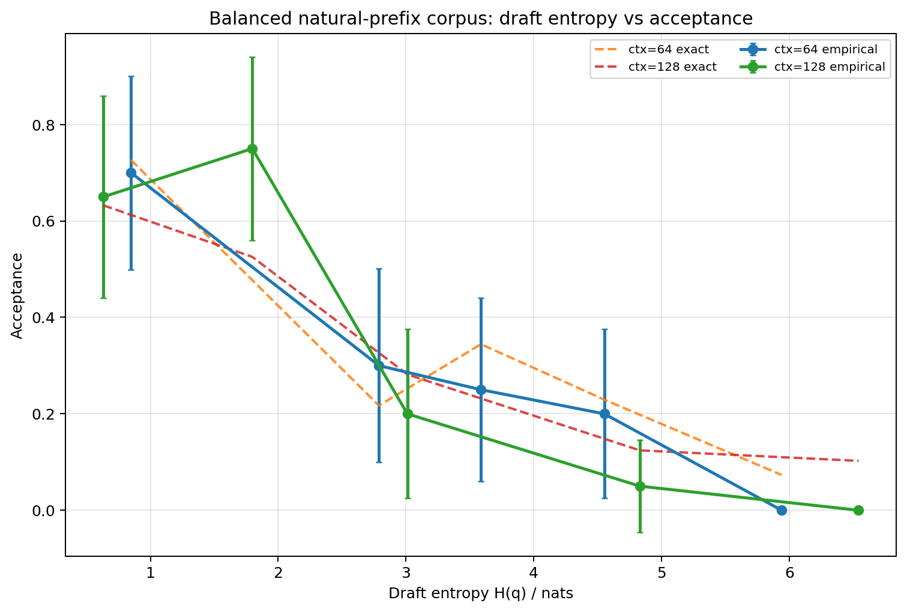
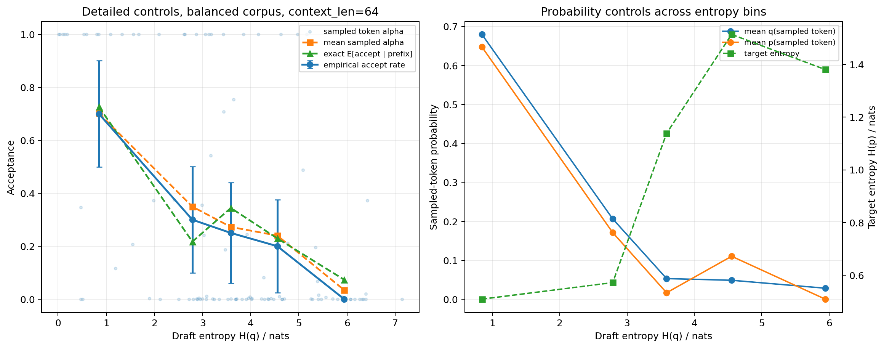
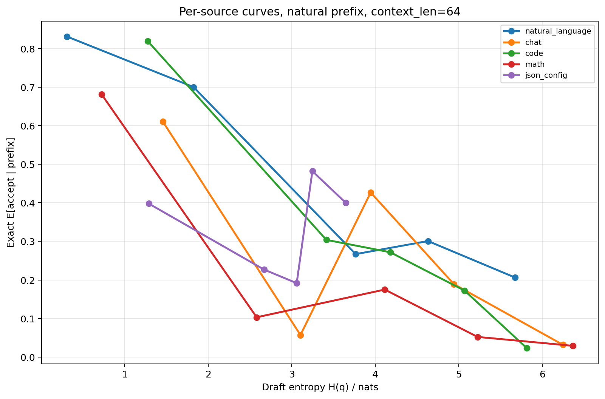
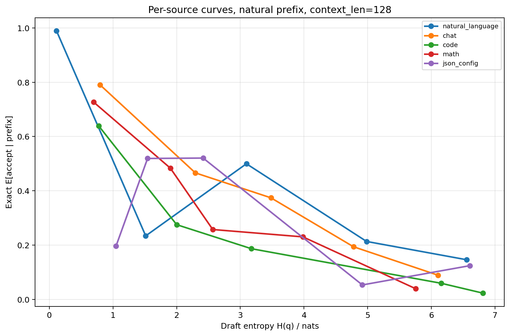
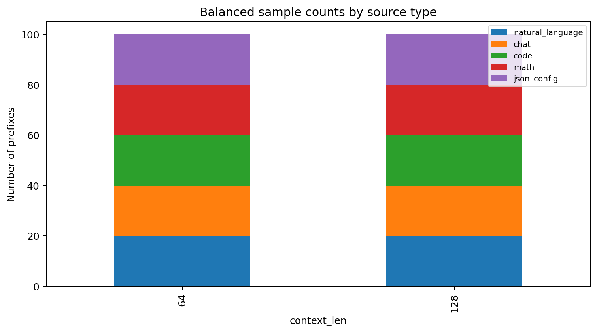

# Real-data natural-prefix draft entropy experiment

## Design

- Data are real public datasets, not template-generated prompts.
- Natural language: `wikitext/wikitext-103-raw-v1` article/document starts.
- Chat: `OpenAssistant/oasst1` conversation paths from root messages.
- Code: `code_search_net/python` function starts.
- Math: `EleutherAI/hendrycks_math` + `gsm8k` problem starts.
- Structured JSON: real `OpenAssistant/oasst1` rows serialized as JSON.
- Context lengths: [64, 128]
- Samples per type: 20
- Context construction: first N tokens from natural starts; no random middle-window truncation.

## Logic checks

- Total token-level records: 200
- Probability range checks passed: True
- Natural prefix flag all true: True
- Tokenizer MD5: {'Model/Llama-7B-Chat-Target/tokenizer.model': 'eeec4125e9c7560836b4873b6f8e3025', 'Model/Llama-68M-Draft/tokenizer.model': 'eeec4125e9c7560836b4873b6f8e3025'}
- Empirical acceptance vs mean sampled alpha by context:
  - ctx=64: empirical=0.2900, mean_alpha=0.3197, abs_diff=0.0297
  - ctx=128: empirical=0.3300, mean_alpha=0.3265, abs_diff=0.0035

## Correlations: draft entropy vs exact acceptance

- ctx=64: Spearman=-0.5800, Pearson=-0.6801
- ctx=128: Spearman=-0.5574, Pearson=-0.6420

## Main figures

