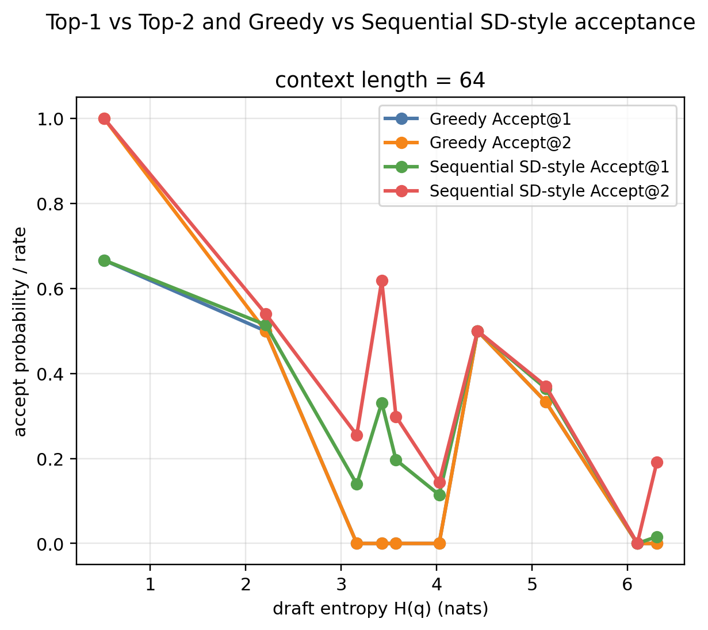
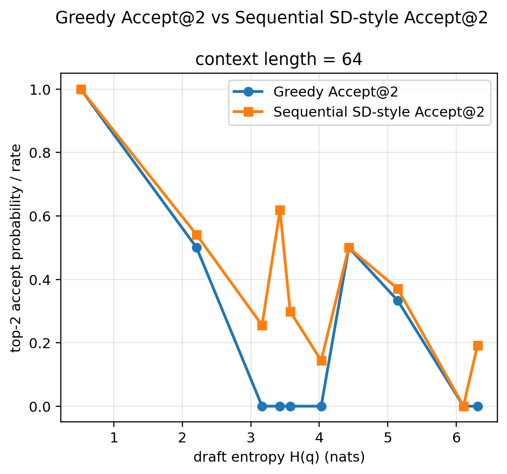
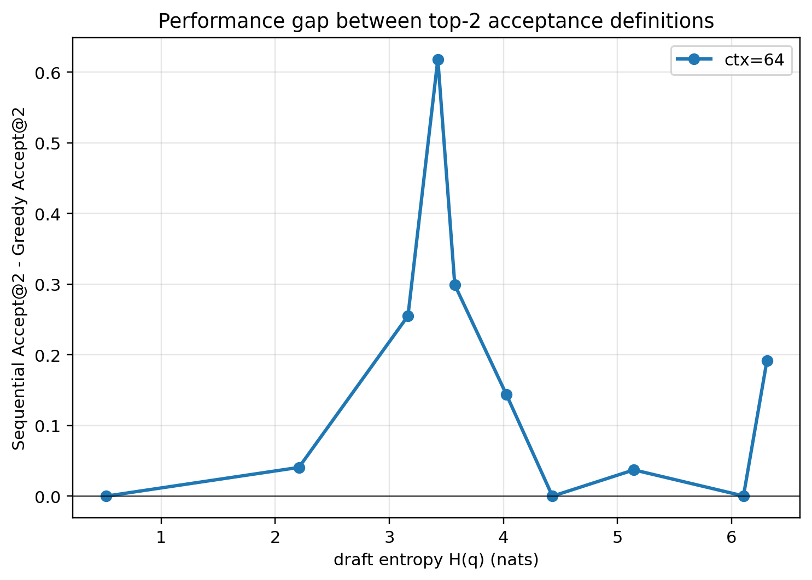
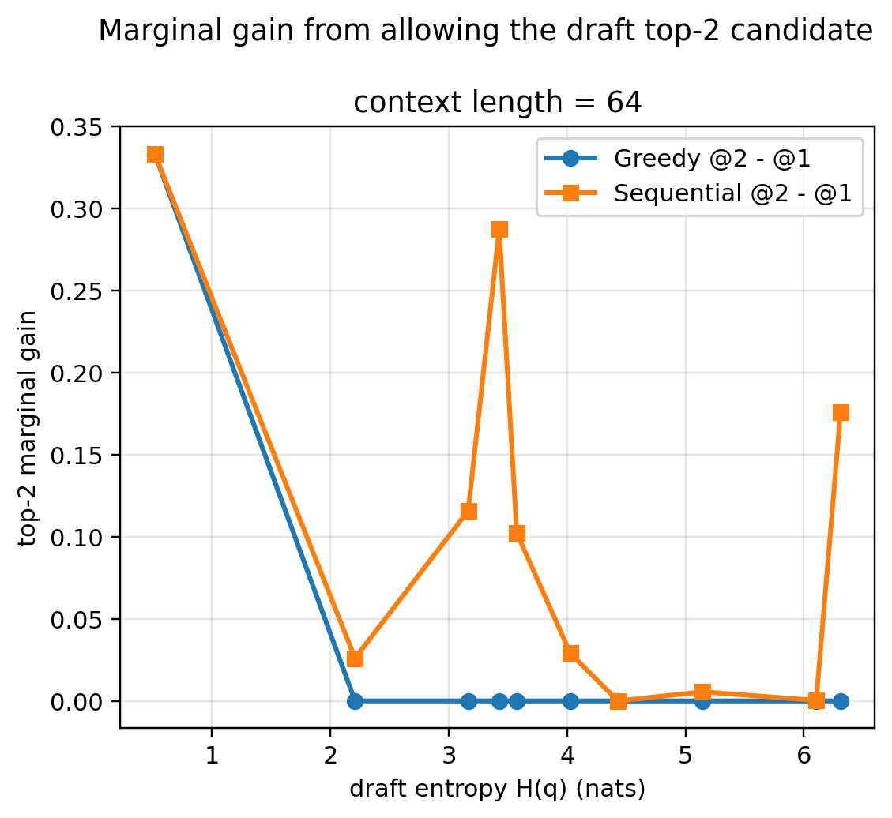
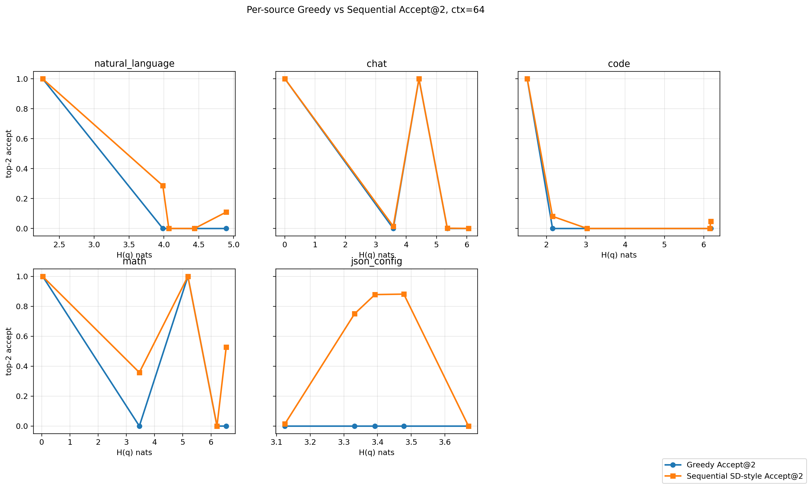

# Top-2 draft entropy acceptance experiment

## Research question

Given the draft model's next-token distribution entropy `H(q)`, evaluate whether allowing the draft model to propose its top-2 tokens improves the probability that at least one candidate is accepted by the target model.

## Acceptance definitions

1. **Greedy Accept@2**: the target model greedily emits `argmax p`; draft top-2 is accepted iff that token is in `{draft_top1, draft_top2}`.
2. **Sequential SD-style Accept@2**: validate `draft_top1` with `alpha1=min(1,p(d1)/q(d1))`; if rejected, validate `draft_top2` with `alpha2=min(1,p(d2)/q(d2))`. Expected acceptance is `alpha1 + (1-alpha1)*alpha2`.

The second metric is an SD-style candidate-set metric, not a full standard speculative decoding generation algorithm.

## Data and models

- Reused the same real, balanced, natural-prefix records from the previous experiment.
- Context lengths: [64]
- Samples per type: 5000
- Source types: natural_language, chat, code, math, json_config.
- Target model: `Model/Llama-7B-Chat-Target`
- Draft model: `Model/Llama-68M-Draft`
- Total rows: 25

## Logic checks

- Probability ranges OK: True
- Natural-prefix flag all true: True
- Draft top-1/top-2 IDs distinct: True
- Greedy @2 >= Greedy @1 for every row: True
- Sequential @2 >= Sequential @1 for every row: True
- Sequential formula max abs error: 1.372e-08
- Sequential expected vs empirical Bernoulli checks:
  - ctx=64: seq@1 expected=0.2828, empirical=0.2800, diff=0.0028; seq@2 expected=0.3982, empirical=0.4000, diff=0.0018

## Overall correlations with draft entropy

- ctx=64: Greedy@2 Spearman=-0.4156, Pearson=-0.5218; Seq@2 Spearman=-0.4693, Pearson=-0.5039

## Mean top-2 acceptance by source type

context_len,source_type,n,entropy_mean,greedy_accept_top1_rate,greedy_accept_top2_rate,greedy_top2_gain_mean,seq_accept_top1_mean,seq_accept_top2_mean,seq_top2_gain_mean,seq_minus_greedy_top2,target_mass_on_draft_top2_mean,target_entropy_mean,seq_relative_gain_over_greedy_top2
64,chat,5,3.8829495958052576,0.4,0.4,0.0,0.40301949734838444,0.40348587215412407,0.00046637479681521654,0.003485872154124048,0.40002300793639733,0.6104046261520125,0.00871468038531012
64,code,5,3.806488013267517,0.0,0.2,0.2,0.015392377399629708,0.22582229832927112,0.21042992276245515,0.025822298329271104,0.2040765590874905,0.17682425053790213,0.12911149164635552
64,json_config,5,3.3993849754333496,0.0,0.0,0.0,0.27878256310445926,0.505107705063034,0.22632514195457318,0.505107705063034,0.06243799547910225,1.653369005525019,
64,math,5,4.2845532931387424,0.4,0.4,0.0,0.4522960616473831,0.5771723376646094,0.12487628171575693,0.17717233766460938,0.2915350207214516,1.0509270077571273,0.44293084416152345
64,natural_language,5,3.9293691158294677,0.2,0.2,0.0,0.2647341250198224,0.2793520600906049,0.014617935071510147,0.07935206009060491,0.1682982947448636,1.7503211498260498,0.3967603004530246

## Main figures

## Key files

- `top2_token_level_records.csv`
- `top2_entropy_bin_summary_by_context.csv`
- `top2_entropy_bin_summary_by_context_source.csv`
- `top2_source_type_summary.csv`
- `top2_correlations.csv`
- `audit_checks.json`
- `metadata.json`