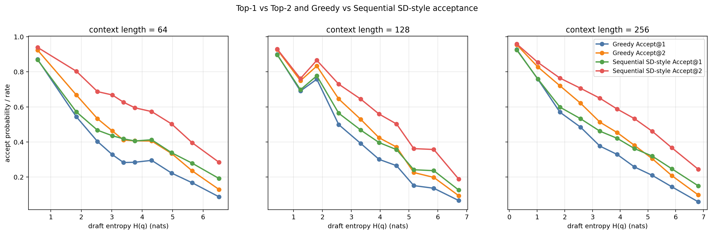
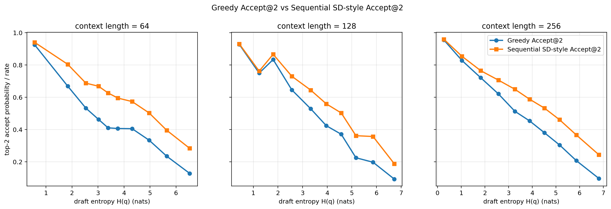
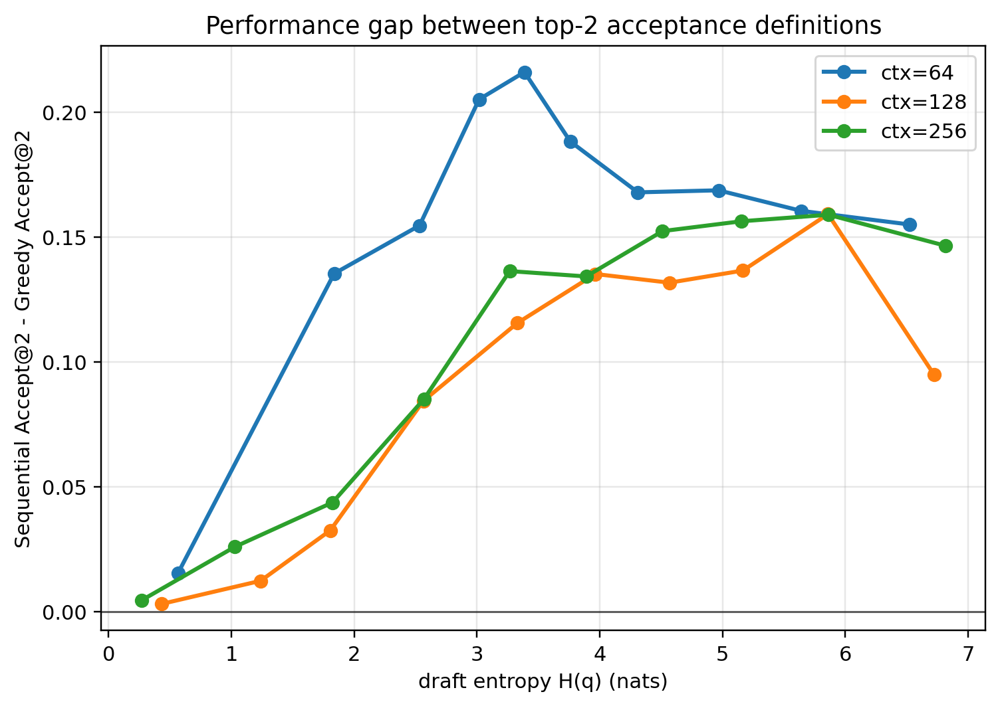
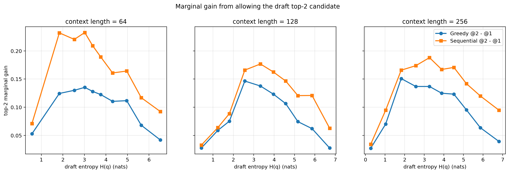
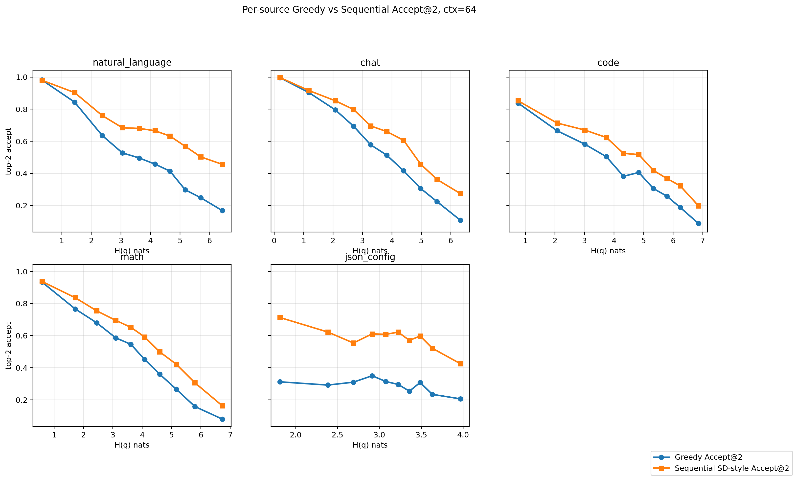
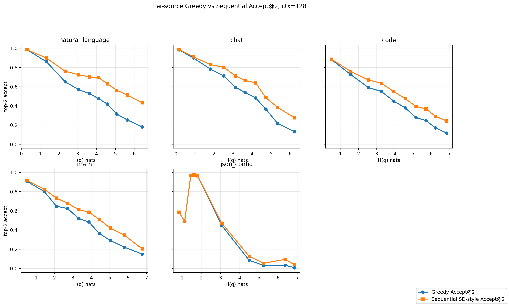
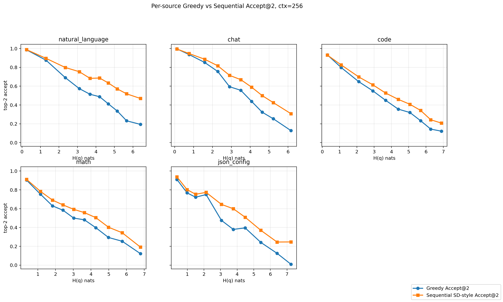

# Top-2 draft entropy acceptance experiment

## Research question

Given the draft model's next-token distribution entropy `H(q)`, evaluate whether allowing the draft model to propose its top-2 tokens improves the probability that at least one candidate is accepted by the target model.

## Acceptance definitions

1. **Greedy Accept@2**: the target model greedily emits `argmax p`; draft top-2 is accepted iff that token is in `{draft_top1, draft_top2}`.
2. **Sequential SD-style Accept@2**: validate `draft_top1` with `alpha1=min(1,p(d1)/q(d1))`; if rejected, validate `draft_top2` with `alpha2=min(1,p(d2)/q(d2))`. Expected acceptance is `alpha1 + (1-alpha1)*alpha2`.

The second metric is an SD-style candidate-set metric, not a full standard speculative decoding generation algorithm.

## Data and models

- Reused the same real, balanced, natural-prefix records from the previous experiment.
- Context lengths: [64, 128, 256]
- Samples per type: 5000
- Source types: natural_language, chat, code, math, json_config.
- Target model: `Model/Llama-7B-Chat-Target`
- Draft model: `Model/Llama-68M-Draft`
- Total rows: 75000

## Logic checks

- Probability ranges OK: True
- Natural-prefix flag all true: True
- Draft top-1/top-2 IDs distinct: True
- Greedy @2 >= Greedy @1 for every row: True
- Sequential @2 >= Sequential @1 for every row: True
- Sequential formula max abs error: 8.335e-08
- Sequential expected vs empirical Bernoulli checks:
  - ctx=64: seq@1 expected=0.4385, empirical=0.4395, diff=0.0010; seq@2 expected=0.6073, empirical=0.6084, diff=0.0011
  - ctx=128: seq@1 expected=0.4758, empirical=0.4776, diff=0.0017; seq@2 expected=0.5899, empirical=0.5910, diff=0.0011
  - ctx=256: seq@1 expected=0.4772, empirical=0.4786, diff=0.0013; seq@2 expected=0.6122, empirical=0.6133, diff=0.0010

## Overall correlations with draft entropy

- ctx=64: Greedy@2 Spearman=-0.4022, Pearson=-0.4188; Seq@2 Spearman=-0.3703, Pearson=-0.4028
- ctx=128: Greedy@2 Spearman=-0.5341, Pearson=-0.5345; Seq@2 Spearman=-0.4730, Pearson=-0.4778
- ctx=256: Greedy@2 Spearman=-0.5226, Pearson=-0.5239; Seq@2 Spearman=-0.4447, Pearson=-0.4561

## Mean top-2 acceptance by source type

context_len,source_type,n,entropy_mean,greedy_accept_top1_rate,greedy_accept_top2_rate,greedy_top2_gain_mean,seq_accept_top1_mean,seq_accept_top2_mean,seq_top2_gain_mean,seq_minus_greedy_top2,target_mass_on_draft_top2_mean,target_entropy_mean,seq_relative_gain_over_greedy_top2
64,chat,5000,3.4494467061793666,0.4306,0.5536,0.123,0.5140313229943205,0.6620466569161746,0.14801533368388314,0.10844665691617461,0.5206541373940468,0.7189035507767754,0.1958935276665004
64,code,5000,4.294691164372535,0.338,0.4218,0.0838,0.40287974796165615,0.5209224088143283,0.11804266090627434,0.09912240881432827,0.3949083919513487,0.8099688377408671,0.23499859842183088
64,json_config,5000,3.0547233006894587,0.1982,0.2876,0.0894,0.30812809458442897,0.5843914787655496,0.2762633839908216,0.2967914787655496,0.2619246500859729,1.249051443570635,1.031959244664637
64,math,5000,3.7829511033062126,0.3804,0.4828,0.1024,0.4510407470935274,0.5856934869502541,0.134652739791598,0.10289348695025413,0.4594768590760742,0.6799460405270622,0.21311824140483457
64,natural_language,5000,3.6914068716931974,0.3934,0.5072,0.1138,0.5163844765607744,0.6835321632651872,0.16714768676367925,0.1763321632651872,0.4479116613142185,1.3738993706087517,0.3476580506017098
128,chat,5000,3.2650359627480388,0.4698,0.5716,0.1018,0.5413089979297921,0.6699314273415146,0.12862242937773674,0.09833142734151457,0.5419934210127854,0.6516579721214918,0.17202838933085124
128,code,5000,4.036250873458479,0.3536,0.4398,0.0862,0.40480179876879624,0.5278751632084244,0.12307336434419341,0.0880751632084244,0.4242571150955731,0.6490379737303008,0.2002618535889595
128,json_config,5000,3.2856989516194908,0.444,0.4594,0.0154,0.4555202821549705,0.4771822881248862,0.021662006050502332,0.017782288124886247,0.45225053622021033,0.6859596484088317,0.03870763631886428
128,math,5000,3.5974439717438536,0.392,0.5014,0.1094,0.4475347403805271,0.583715908777413,0.13618116834070507,0.08231590877741302,0.4858129308114465,0.511797479731798,0.16417213557521546
128,natural_language,5000,3.6414698171344586,0.4176,0.5244,0.1068,0.5299632813952155,0.6907843437051273,0.1608210622042898,0.16638434370512734,0.4560278758655213,1.391326759399791,0.3172851710624091
256,chat,5000,3.122845375031536,0.4852,0.5834,0.0982,0.5554528542397976,0.6851139216449912,0.1296610673804891,0.10171392164499116,0.5517318061588593,0.6572802816035064,0.17434679747170234
256,code,5000,3.841972183739394,0.3648,0.4552,0.0904,0.4051421918978224,0.5255584263046303,0.1204162344374518,0.07035842630463035,0.4453545688185801,0.5317052399692421,0.15456596288363433
256,json_config,5000,3.5347982368960045,0.3986,0.478,0.0794,0.4610693264232121,0.5884627509685747,0.12739342462568362,0.11046275096857472,0.46227732358611984,0.9486279467434356,0.23109362127316888
256,math,5000,3.420934943908546,0.3886,0.4922,0.1036,0.4326741794573318,0.5622143810979985,0.12954020179389167,0.07001438109799846,0.477895155561066,0.4562638890998566,0.14224782831775387
256,natural_language,5000,3.675417679727846,0.418,0.5302,0.1122,0.5317628245375281,0.6998126437996147,0.16804981919780415,0.16961264379961472,0.452943626715819,1.452908342012071,0.31990313806038234

## Main figures

## Key files

- `top2_token_level_records.csv`
- `top2_entropy_bin_summary_by_context.csv`
- `top2_entropy_bin_summary_by_context_source.csv`
- `top2_source_type_summary.csv`
- `top2_correlations.csv`
- `audit_checks.json`
- `metadata.json`