# Top-1 to Top-5 draft entropy acceptance experiment

## Definitions

- Greedy Accept@k: target greedy token `argmax p` lies in draft top-k candidates.
- Sequential SD-style Accept@k: candidates are validated in draft probability order using `alpha_i=min(1,p(d_i)/q(d_i))`; expected acceptance is `1-prod_i(1-alpha_i)`.
- Marginal gain top-k vs top-(k-1): `Accept@k - Accept@(k-1)`.

## Data and models

- Reused previous real-data natural-prefix cache.
- Context lengths: [64]
- Max k: 5
- Total rows: 25
- Target: `Model/Llama-7B-Chat-Target`
- Draft: `Model/Llama-68M-Draft`

## Logic checks

- Probability ranges OK: True
- Natural-prefix all true: True
- Top-k ids distinct: True
- Greedy/Sequential acceptance monotonic in k: True
- Sequential formula max abs error: 8.718e-08

## Overall mean Accept@k

context_len,k,n,greedy_accept,seq_accept,greedy_gain_vs_prev,seq_gain_vs_prev,seq_minus_greedy
64,1,25,0.2,0.28284492015838625,0.2,0.28284492015838625,0.08284492015838624
64,2,25,0.24,0.3981880521774292,0.04,0.11534313201904296,0.1581880521774292
64,3,25,0.28,0.45959006309509276,0.04,0.06140201091766358,0.17959006309509273
64,4,25,0.32,0.5210926866531372,0.04,0.061502623558044436,0.20109268665313723
64,5,25,0.44,0.6189821243286133,0.12,0.09788943767547607,0.17898212432861332

## Entropy correlations for ALL sources

- ctx=64; G@1 rho=-0.3051; S@1 rho=-0.4012; G@2 rho=-0.4156; S@2 rho=-0.4693; G@3 rho=-0.3830; S@3 rho=-0.4604; G@4 rho=-0.3448; S@4 rho=-0.3757; G@5 rho=-0.3688; S@5 rho=-0.3739

## Main figures

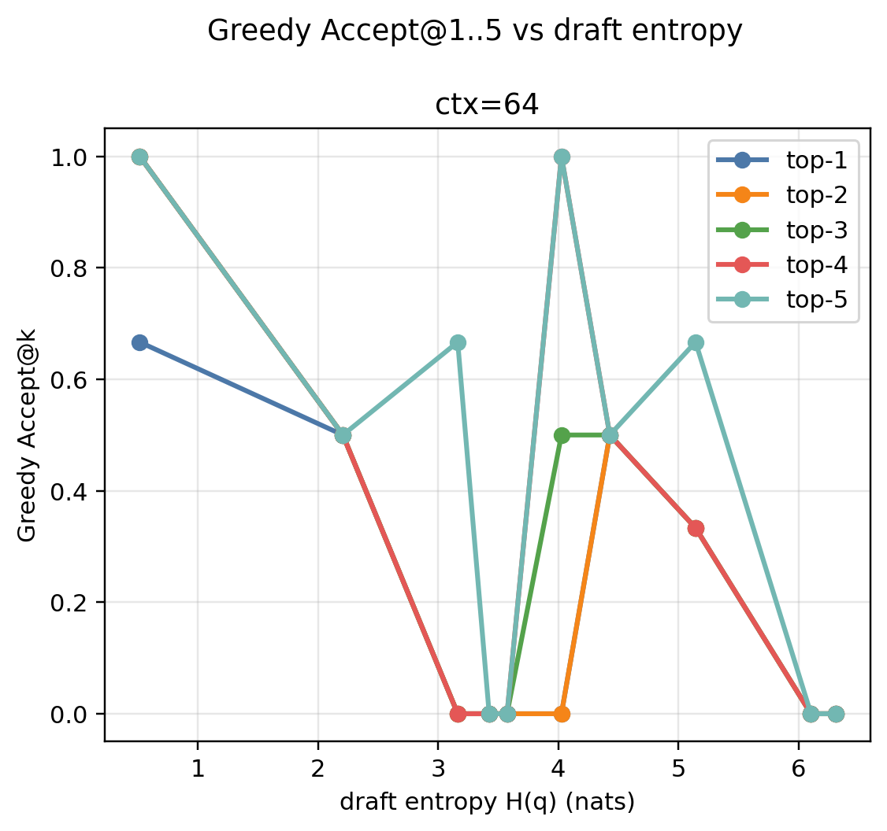

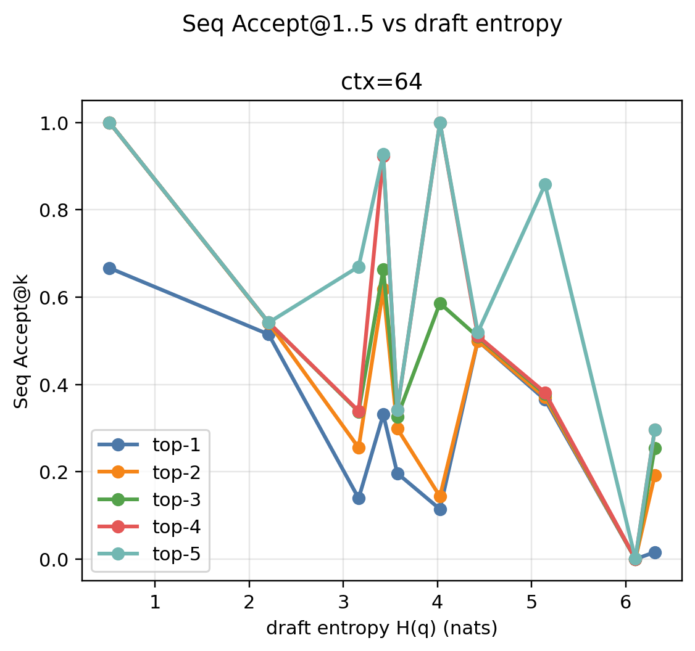

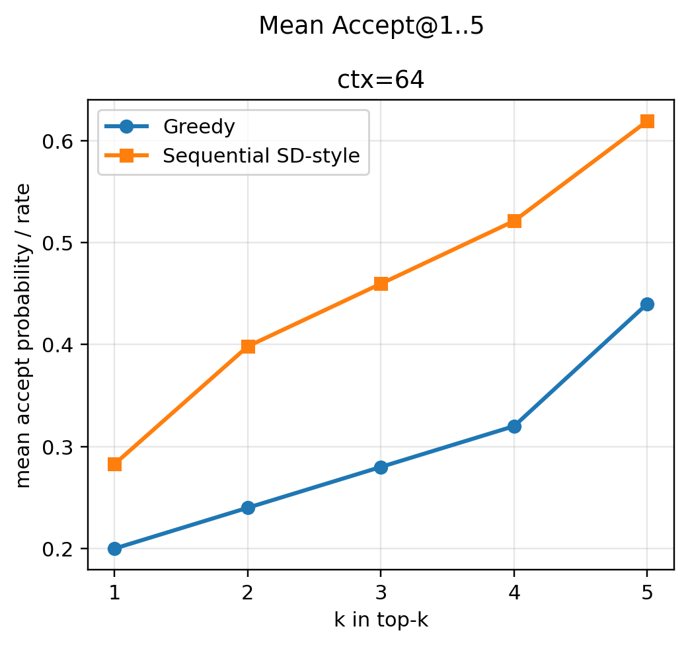

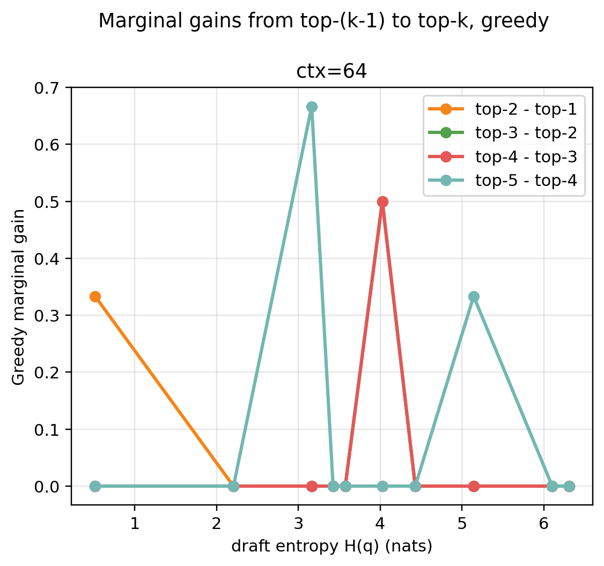

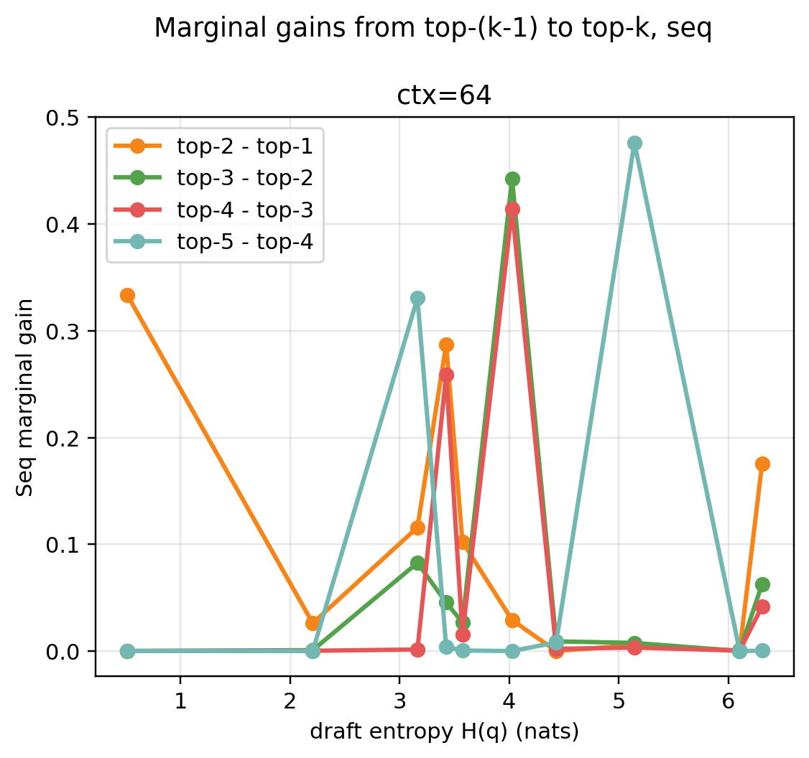

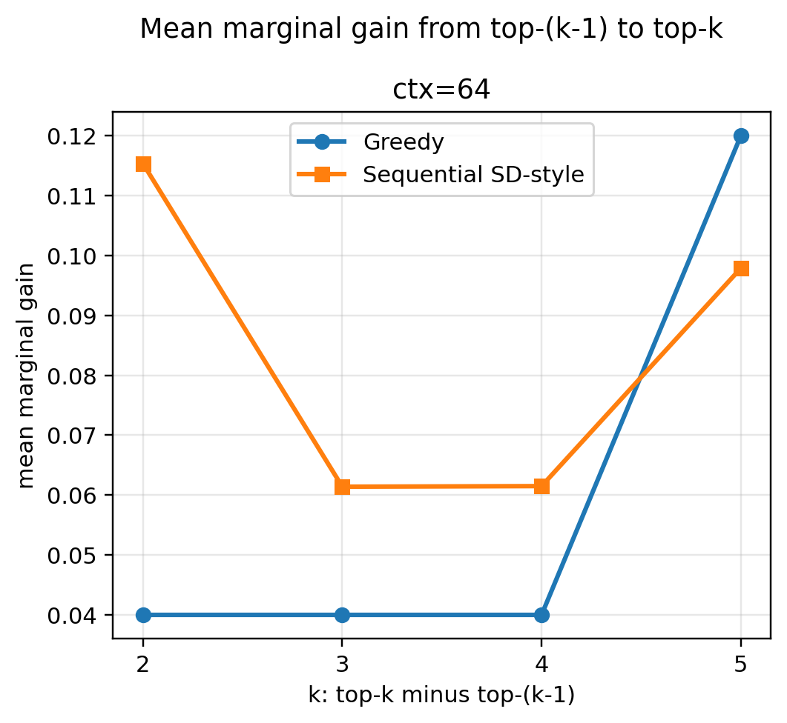

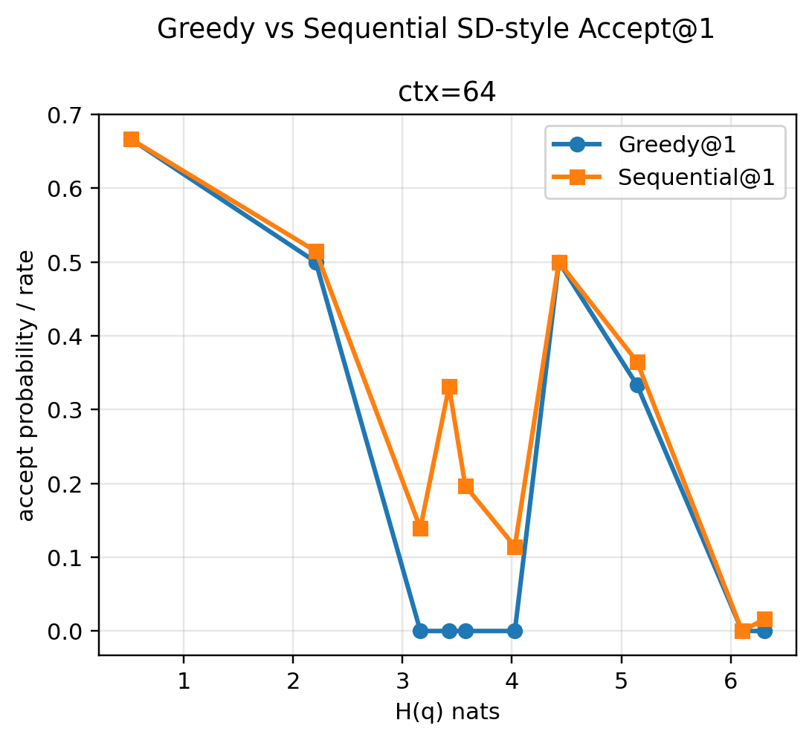

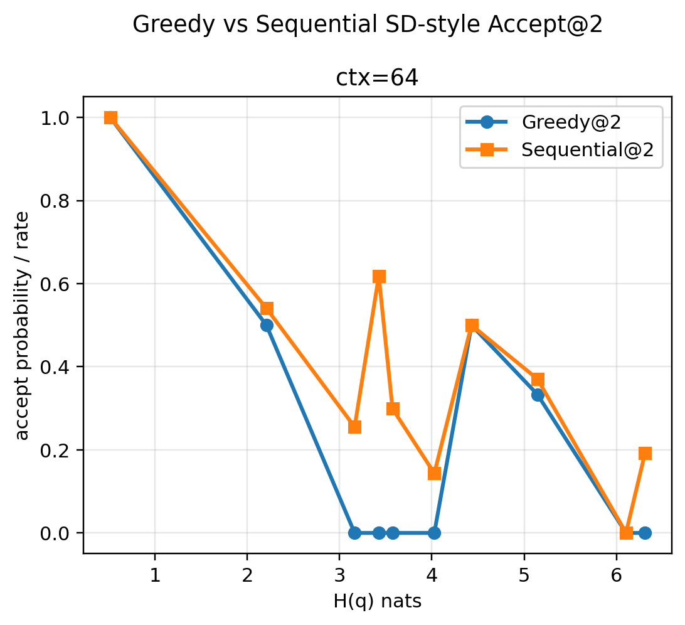

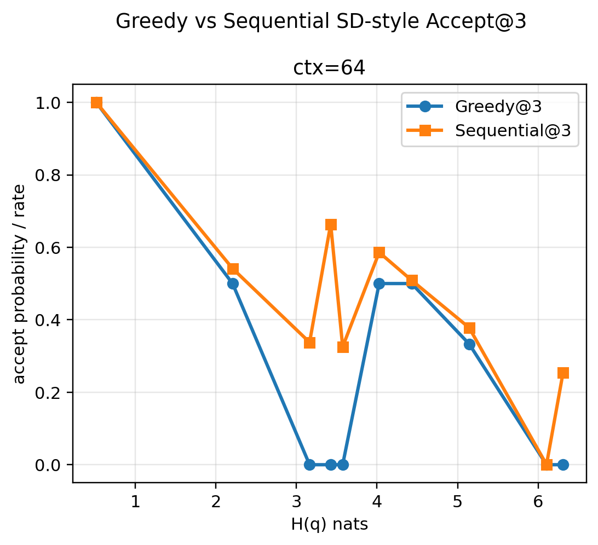

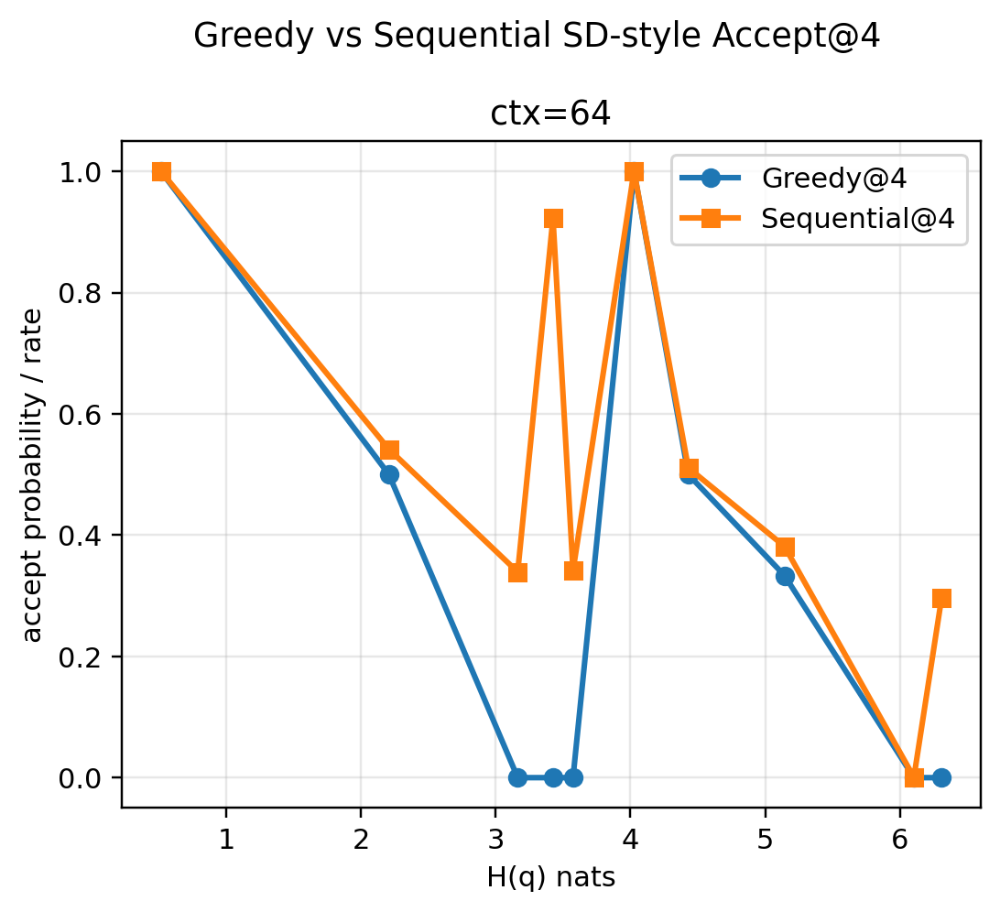

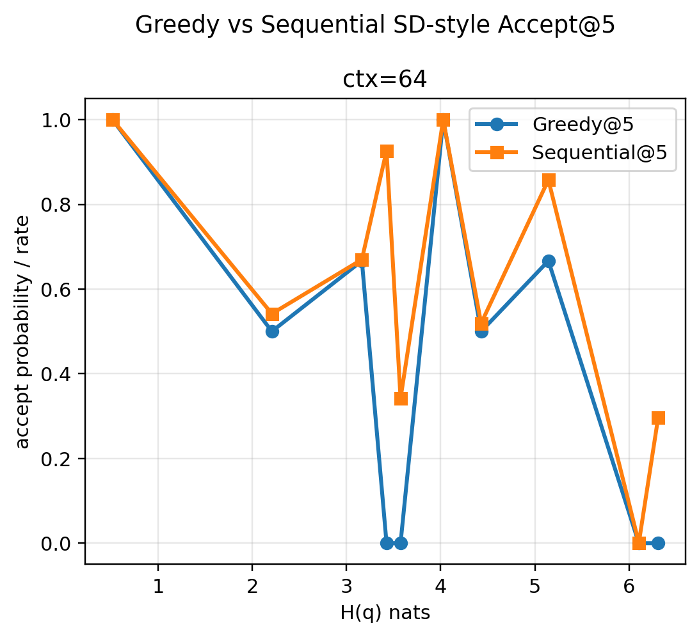

## Key files

- `topk_token_level_records.csv`
- `topk_k_summary_by_context.csv`
- `topk_entropy_bin_summary_by_context.csv`
- `topk_entropy_bin_summary_by_context_source.csv`
- `topk_source_type_summary.csv`
- `topk_correlations.csv`
- `audit_checks.json`
- `metadata.json`