# Top-1 to Top-5 draft entropy acceptance experiment

## Definitions

- Greedy Accept@k: target greedy token `argmax p` lies in draft top-k candidates.
- Sequential SD-style Accept@k: candidates are validated in draft probability order using `alpha_i=min(1,p(d_i)/q(d_i))`; expected acceptance is `1-prod_i(1-alpha_i)`.
- Marginal gain top-k vs top-(k-1): `Accept@k - Accept@(k-1)`.

## Data and models

- Reused previous real-data natural-prefix cache.
- Context lengths: [64, 128, 256]
- Max k: 5
- Total rows: 75000
- Target: `Model/Llama-7B-Chat-Target`
- Draft: `Model/Llama-68M-Draft`

## Logic checks

- Probability ranges OK: True
- Natural-prefix all true: True
- Top-k ids distinct: True
- Greedy/Sequential acceptance monotonic in k: True
- Sequential formula max abs error: 1.780e-07

## Overall mean Accept@k

context_len,k,n,greedy_accept,seq_accept,greedy_gain_vs_prev,seq_gain_vs_prev,seq_minus_greedy
64,1,25000,0.34804,0.43839440786123274,0.34804,0.43839440786123274,0.09035440786123272
64,2,25000,0.45064,0.607818710846901,0.1026,0.16942430298566818,0.157178710846901
64,3,25000,0.51892,0.6924014641356468,0.06828,0.08458275328874588,0.1734814641356468
64,4,25000,0.56104,0.7413628260874748,0.04212,0.048961361951828,0.18032282608747485
64,5,25000,0.5934,0.7730189234375954,0.03236,0.031656097350120545,0.17961892343759533
128,1,25000,0.41536,0.4757125275850296,0.41536,0.4757125275850296,0.06035252758502957
128,2,25000,0.49932,0.5899329381012917,0.08396,0.11422041051626206,0.09061293810129167
128,3,25000,0.54692,0.6550636192727088,0.0476,0.06513068117141724,0.10814361927270888
128,4,25000,0.58328,0.698527978079319,0.03636,0.04346435880661011,0.11524797807931897
128,5,25000,0.61604,0.7350575566887856,0.03276,0.036529578609466554,0.11901755668878555
256,1,25000,0.41112,0.4772958587265015,0.41112,0.4772958587265015,0.0661758587265015
256,2,25000,0.50788,0.6123822051763534,0.09676,0.13508634644985199,0.10450220517635345
256,3,25000,0.56324,0.6837795433497429,0.05536,0.07139733817338943,0.12053954334974293
256,4,25000,0.598,0.725762258682251,0.03476,0.04198271533250809,0.127762258682251
256,5,25000,0.62444,0.756551927280426,0.02644,0.03078966859817505,0.13211192728042598

## Entropy correlations for ALL sources

- ctx=64; G@1 rho=-0.3956; S@1 rho=-0.3456; G@2 rho=-0.4015; S@2 rho=-0.3697; G@3 rho=-0.4082; S@3 rho=-0.3617; G@4 rho=-0.4096; S@4 rho=-0.3590; G@5 rho=-0.4113; S@5 rho=-0.3611
- ctx=128; G@1 rho=-0.5382; S@1 rho=-0.4887; G@2 rho=-0.5344; S@2 rho=-0.4731; G@3 rho=-0.5222; S@3 rho=-0.4576; G@4 rho=-0.5015; S@4 rho=-0.4287; G@5 rho=-0.4771; S@5 rho=-0.3972
- ctx=256; G@1 rho=-0.5213; S@1 rho=-0.4409; G@2 rho=-0.5233; S@2 rho=-0.4456; G@3 rho=-0.5197; S@3 rho=-0.4373; G@4 rho=-0.5134; S@4 rho=-0.4225; G@5 rho=-0.5089; S@5 rho=-0.4132

## Main figures

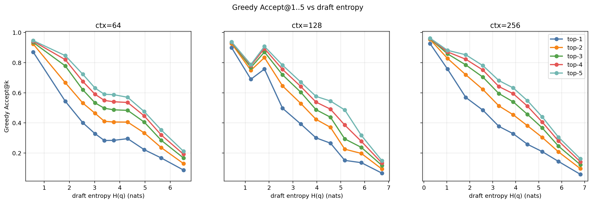

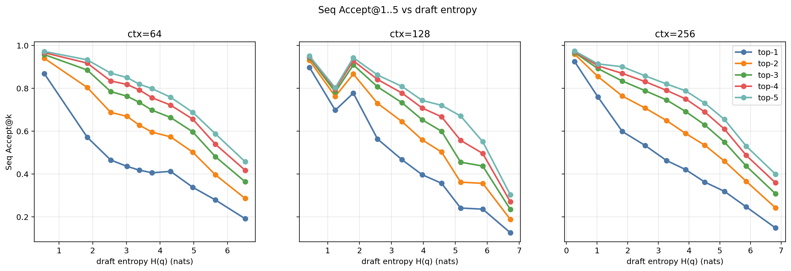

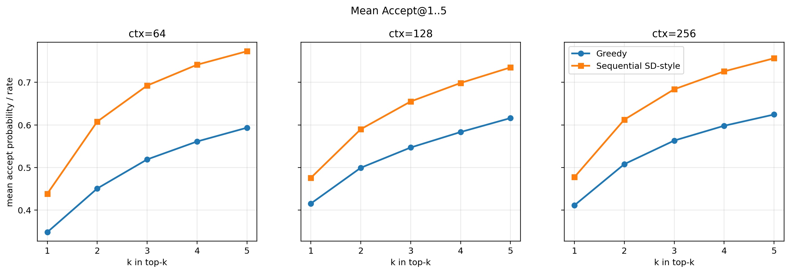

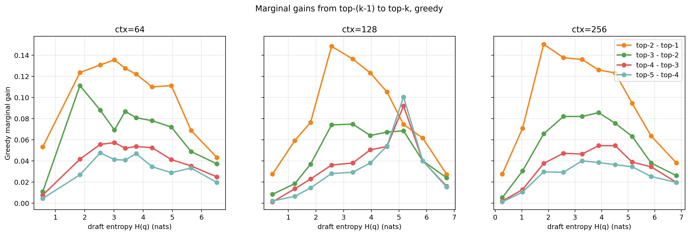

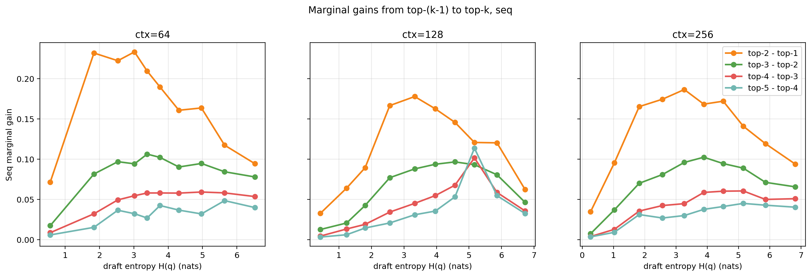

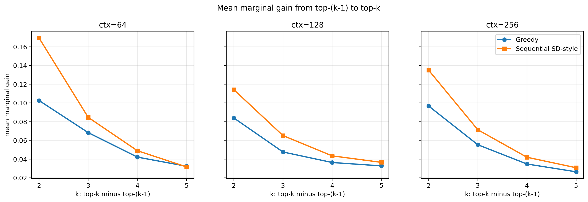

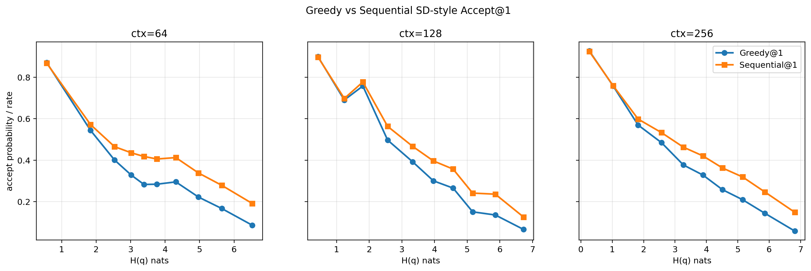

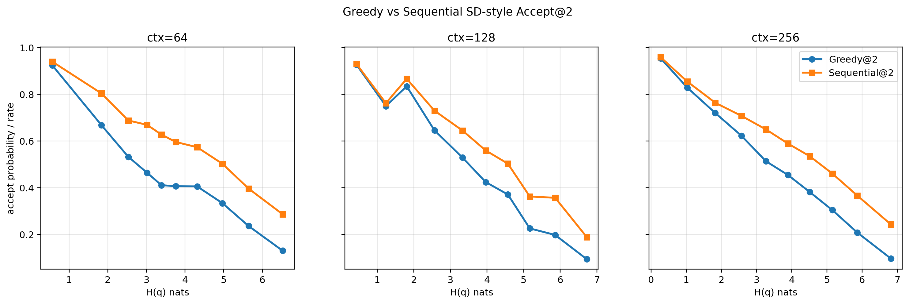

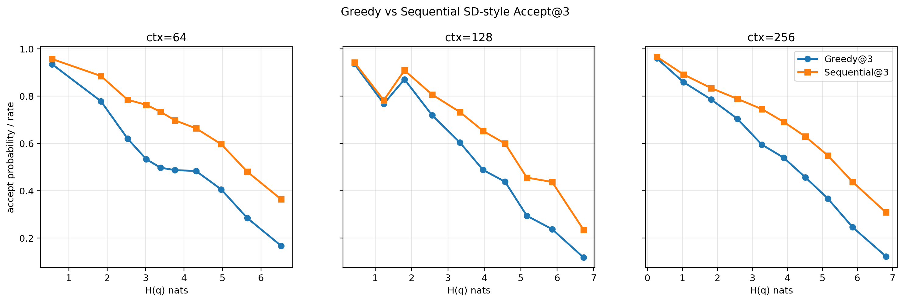

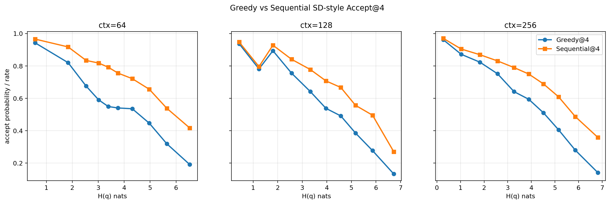

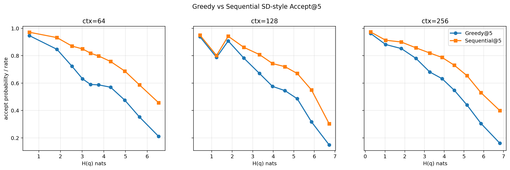

## Key files

- `topk_token_level_records.csv`
- `topk_k_summary_by_context.csv`
- `topk_entropy_bin_summary_by_context.csv`
- `topk_entropy_bin_summary_by_context_source.csv`
- `topk_source_type_summary.csv`
- `topk_correlations.csv`
- `audit_checks.json`
- `metadata.json`